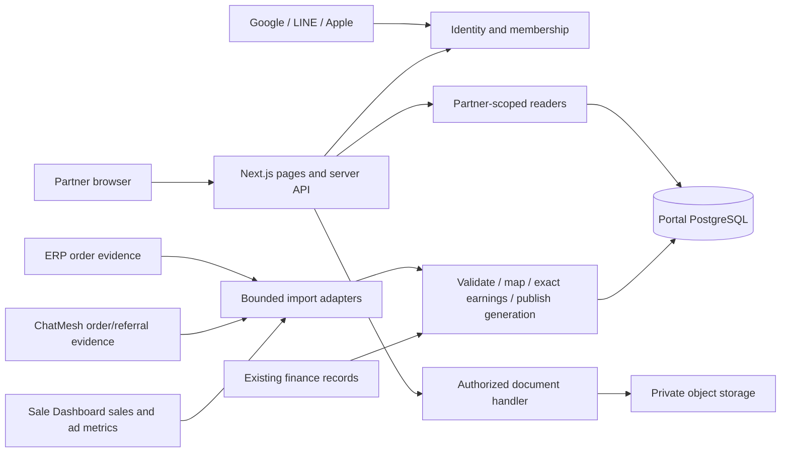

> Implementation status update (D116, 2026-09-11): the credential/invitation transition is implemented in the current worktree; the older “still needs transition” wording below is historical. See [current audit](../implementation/remaining-work-audit.md) for evidence and unresolved release acceptance. Design requirements remain separate from proof of deployment.

> Current source-workflow amendment (D052, 2026-09-10): Marketing registers Ad IDs for Facebook, Shopee, Lazada and TikTok; automated API sync replaces generic per-file manual review as the next planned workflow. Company Marketplace is excluded. See [Ad ID integration design](ad-id-automatic-integration.md). Existing financial invariants and implemented approval/file-import controls remain; this amendment does not claim live support or authorize their removal.

# Labs D x Partner: frontend-first integration architecture

> Current access override D-025 (2026-09-09): [Invitation-only access](invitation-only-access.md) replaces social-provider login with staff-issued invitations and user-selected username/password after the deal. Its credential/invitation/recovery boundaries supersede all social-first sections and provider release gates below. Existing source still needs the documented transition; no financial or visual architecture changes.


Date: 2026-09-07. Scope: small invitation-based partner portal over existing Labs D systems. This is a proposed build design, not a deployed-system claim. Execution order: [implementation plan](../superpowers/plans/2026-09-07-partner-portal.md). Preserve [Phase1 theme](phase-1-theme-design-system.md) and [reduced scope](../research/2026-09-07-partner-portal-reuse-scope.md).

Revised 2026-09-08: [independent stack-fit decision](stack-fit-decision.md) replaces all reasoning based on matching Sale Dashboard. The chosen technologies remain after comparing alternatives against this portal's requirements. Added explicit automatic-refresh contract; prior review receipts apply only to their frozen files.

Whole-system review2026-09-09: [Practicality review](../reviews/2026-09-09-practicality-review.md) assesses all20 tasks and current code. Retain the modular monolith; select one actual source grain and authoritative payment path before adding adapters or financial writers. The row-level approved-period parser does not yet cover the previously allowed approved-summary/file path. Provisioning private storage is conditional on existing authorized source capability. Self-service account-lifecycle and optional metric sequencing remain explicit scope decisions, not automatic removals. This review has not independently accepted the unfinished auth experiment or production behavior.

## 1. Outcome and scope

A partner signs in with Google, LINE or Apple; sees their own earnings, content and payment periods; opens a number to understand its source/calculation; downloads an authorized statement; asks the existing Labs D contact about a specific reference. Three main menus stay Overview / My content / Transactions. Profile holds agreement summary, connected identities, support and sign-out. Staff have a small separately authorized operations surface for invitations/mapping, period publication and recording existing payment evidence.

No product marketplace, new ERP, ads management, wallet, automatic money transfer, broad contract engine, ticket system, campaign workflow suite, global multi-tenant SaaS or automated claim adjudication. Business agreements are inputs, not something the portal negotiates. Supplement briefs/rights remain with existing staff; the portal may show an approved attachment/link, not introduce a new approval product.

Frontend first means all routes, responsive states, access states and financial examples work against validated API-shaped fixtures before the real data adapters land. It does not mean fake social login is accepted as real, nor that fixtures can remain as a production fallback. A visible development-only scenario page selects fixtures; production has no bypass, fixture imports or demo access switch.

## 2. Topology and alternatives

Choose a **single Next.js application**, React + TypeScript, PostgreSQL + Drizzle, Zod boundary validation, TanStack Query for interactive server-state, CSS Modules + semantic CSS tokens, existing icon/motion conventions, Vitest and Playwright. Choose from the portal's needs: integrated routes/assets/session boundary, maintained social-auth host integration, interactive API-driven UI and a small operational surface. Upstream frameworks and ORM receive zero selection weight; consume their APIs, not their internal sessions/schema/component trees. SvelteKit and a same-origin SPA/API app are credible alternatives with documented tradeoffs in the stack-fit decision. Pin supported stable packages and Node LTS at F00 (Node 24 is LTS at this checkpoint); no comparative benchmark superiority claimed.

Authentication recommendation: Better Auth with built-in Google/LINE/Apple, database sessions and explicit linking. Confirm the selected pinned release passes the provider/cookie/no-email tests in A01 before using it for real accounts. Auth.js is the bounded fallback only if that acceptance fails; do not maintain two login engines. Keep all library-specific callbacks/schema adapter details inside identity. The social subject and our membership, not email, determine financial access.

| Alternative | Decision |
|---|---|
| Add celebrity screens directly to Sale Dashboard | Reject for first release: exposes internal permission assumptions and ties external-user releases to the much larger admin app |
| Separate SPA + independent API + distributed workers | Reject now: extra deploy/auth/API boundaries without demonstrated need |
| Same-origin React/Vite + Fastify or Hono in one release | Viable, but requires additional router/static/cache composition; the evaluated Fastify auth bridge adds sensitive integration work without proven net simplification |
| SvelteKit full-stack app | Credible close alternative; no proven performance disadvantage, no dismissal based on familiarity. Selected React/Next design is a judgment, not a universal best claim |
| One portal app with internal domain modules and scheduled import entry point | Recommend: easy to preview, one API contract, no provider fan-out in page loads, additive upstream work |



Deployment proposal: one web service, a logical portal database with dedicated credentials, private object bucket, and eventually a scheduled `npm run import:once` process from the same repository/build. Hosting is independently selected for runtime requirements, measured load and cost; Railway is only a candidate, with no preference because other projects use it. No Redis, message broker, realtime sockets or permanent worker in the initial release. A hosted scheduler or existing runner invokes one bounded import job; it does not run ad API ingestion again. Exact domain, infrastructure binding and additional cost require confirmation before provisioning.

## 3. Module boundaries and file ownership

```text
app/(public)/login/page.tsx
app/(public)/access/page.tsx
app/(partner)/layout.tsx
app/(partner)/overview/page.tsx
app/(partner)/content/page.tsx
app/(partner)/content/[contentId]/page.tsx
app/(partner)/content/[contentId]/ads/[adId]/page.tsx
app/(partner)/transactions/page.tsx
app/(partner)/transactions/[statementId]/page.tsx
app/(partner)/account/page.tsx
app/(staff)/ops/{partners,imports,periods}/page.tsx
app/api/auth/[...all]/route.ts
app/api/v1/partner/**/route.ts
app/api/v1/ops/**/route.ts
src/contracts/{common,session,overview,content,earnings,statements,account,operations,notifications,changes}.ts
src/shared/ui/{Button,Card,Dialog,Sheet,DataState,Money,StatusBadge,FilterBar}.tsx
src/shared/charts/{TrendChart,BarChart,DonutChart}.tsx
src/shared/theme/{tokens.css,ThemeProvider.tsx}
src/shared/query/{provider.tsx,keys.ts}
src/features/{shell,login,overview,content,transactions,account,operations}/
src/server/modules/{identity,partners,content,earnings,statements,imports}/
src/server/platform/{db,documents,observability}/
src/server/adapters/{approved-period,sale-dashboard,erp,chatmesh}/
db/schema/{identity,partners,content,earnings,statements,imports}.ts
db/migrations/
dev/scenarios/  # explicit development harness, not shipped routes
tests/{contracts,unit,integration,e2e,performance}/
scripts/{import-once,verify-build,verify-no-demo}.ts
```

| Owner | Owns | Public behavior | Must not own |
|---|---|---|---|
| identity | Social identity, sessions, invitation claims, identity linking | resolve authenticated principal, consume invite, revoke sessions | Inferring partner rights from provider email or client-supplied partner ID |
| partners | Memberships, partner/content/SKU mappings, dated agreement versions | authorized scope and applicable terms | Upstream orders or bank transfers |
| content | Content inventory, ad associations, display metrics with provenance | Content/ad detail and allowed metric selectors | Converting Meta attributed value into money owed |
| earnings | Eligible bases, rate evaluation, adjustments, generation-consistent totals | Pure exact calculation and scoped read services | Payment execution or provider OAuth |
| statements | Frozen periods/lines, recorded settlements and protected evidence | Publish period, record existing payment, immutable history | Rewriting closed lines when source changes |
| imports | Validation, cursors, source revisions, unresolved rows, atomic publication | One bounded import run, retry and rejection report | Redefining money semantics per connector |
| shared UI | Appearance, focus/keyboard behavior, loading patterns | Props-only presentation | Fetches, membership checks, summing financial business totals |

Dependency direction: routes → feature/server service → owning domain contract → repositories/adapters. Domain math imports only contracts/pure helpers; provider adapters import shared ingestion types, not UI. Feature A cannot import Feature B internals; share stable behavior through contracts/shared only after actual reuse. Only integration owner edits routes, contract versions and root provider composition across work packages. One migration-number owner. No extra package needed solely because a folder is a module.

## 4. Historical social-first login contract — superseded by D-025

Flows: login → provider redirect/callback → verified external identity → app session → active membership → requested authorized route. A valid provider account with no membership lands on `access/pending`, with no finance data. Invite tokens are single-use, hashed at rest, expiring and consumed transactionally. A link alone is not sufficient financial access: staff pre-bind a verified provider identity, or approve the claimed identity before membership activation. This supports LINE without email and Apple relay addresses.

Identity key is `(provider, issuer/client-namespace, subject)` mapped to internal user ID. Display name/email are metadata. Disable implicit email linking. Connecting a second provider requires a fresh authenticated session and a separately verified provider callback with state/nonce/PKCE as supported; a subject already linked to another user causes a conflict, never an automatic merge. Unlink must leave another usable method; otherwise verified staff-assisted recovery. Recovery never uses a claim of equal email as proof; membership moves and revocations are audited and invalidate affected sessions.

If the chosen library requires an email but LINE omits it, use its supported profile mapping to a deterministic internal address such as `sha256(issuer + NUL + subject)@identity.invalid`, marked unverified and non-deliverable. This is library storage only, never a contact address, identity-match rule, invitation proof or recovery destination. Store optional real contact separately; test that no mail is ever attempted to the placeholder. Prefer scopes `openid profile` for LINE and do not depend on email approval.

Pinned-library acceptance must verify `account.accountLinking.disableImplicitLinking: true`, no session cookie cache, no final-method unlink, and explicit different-email linking after proof of both identities. Explicitly disable LINE default scopes before selecting `openid profile`; use S256 PKCE. Disable unused native ID-token sign-in and password/email-recovery routes. Check the actual pinned API rather than copying current documentation as executable configuration.

Google: use OIDC authorization-code flow, validate issuer/audience/nonce/expiry with the maintained library; use `sub` not email. LINE: dedicated Login channel, registered callbacks, OIDC subject, state/nonce and PKCE; Messaging API user IDs are not assumed interchangeable across providers. Apple: Services ID associated with suitable primary App ID and Sign in with Apple configuration, registered HTTPS return URL/domain and private signing key/client-secret rotation. Apple web callback `form_post` and transient-cookie handling must be tested on Safari; do not hand-roll a broad SameSite exception for all endpoints. First response can include name/user object; subsequent login must work without it; relay or absent profile fields must not break identity.

Provider buttons follow official branding while surrounding login uses existing theme. Public setup may show a disabled provider with honest explanation while development credentials are absent; final authentication acceptance requires real success/cancel/error/relogin for **all three**, not two plus a permanently disabled Apple button. Provider-console inventory and final HTTPS domains are prerequisites, not proven missing accounts.

Sessions: opaque HttpOnly Secure cookie in deployed HTTPS, database-backed, 30-day rolling expiry/24h refresh proposed. Cookie result caching disabled initially; membership/revocation checked on every financial/doc endpoint. Browser cache clears on logout, account switch and 401/403; no persistent money cache in localStorage. CSRF-protected mutations, rate-limited login/invite/ops, allowlisted relative return URL. Staff use an explicitly provisioned role with fresh reauthentication for membership or published-payment edits. The browser never receives provider secrets or upstream credentials.

Apple operational policy: use a short-lived client-secret JWT with automated 30-day renewal proposal, alert 14 and 7 days before the configured expiry, and record responsible owner/next renewal date plus Key ID reference (never private key). A01 confirms allowed validity and actual library behavior from Apple's current documentation. Pin the exact Apple callback route, e.g. `/api/auth/callback/apple`; use the maintained library's validated transaction mechanism with narrowly scoped temporary cross-site cookie where supported. If the library needs a broader cookie path, document why and prove single-use browser/state binding with short transaction expiry; do not hand-roll OAuth solely to force a path. Ordinary session cookies and other mutations retain their protections. R01 tests expired-secret handling and the renewal runbook; no demo fallback.

## 5. Screens and meaningful states

| Screen | Primary content | Optional detail / required states |
|---|---|---|
| Login/access | Google, LINE, Apple; concise trust/support copy | redirecting, cancelled, retry, provider unconfigured, invitation expired/used, waiting approval, revoked access |
| Overview | period earnings with estimate/confirmed split; confirmed unpaid; next scheduled payout; last update | source delay, partial coverage, no agreement, no activity, failed load; payments explicitly use payout scope independent of earnings-date filters |
| My content | Portrait cover, title, brand, publication date, earned amount when mapped | search/date/brand filters, cursor pagination, unavailable vs zero, content removed at provider |
| Content detail | post link, content-period context, eligible sales/orders, earnings/rate, earning status | compact Earnings / Performance sections; associated ad cards and source metadata on demand; approved attachment optional |
| Ad detail | creative, associated content, active/paused as of source, impressions/link clicks/video views when supplied | metric definitions/time window/source; platform-attributed orders/value clearly separated; hide spend/ROAS unless agreement authorizes them; no ad controls |
| Transactions | period, amount, pending/paid/partially paid, actual/scheduled date | period detail bridge, adjustments/reasons, file download, payment evidence and ask-about-reference |
| Account | agreement summary, linked login providers, support, sign out | connect conflict, last-provider unlink protection, no financial edits |
| Header notifications | recent published statement and recorded payment notices | real scoped count, empty/loading/error, mark seen, deep link to owned statement; no hardcoded sample badge |
| Internal operations | partner/invite mapping, import exception list, publish period, record finance payment | duplicate/invalid import, unbalanced period, evidence absent, authorization/re-auth failure; no user-facing global admin menu |

Preserve tokens, fonts (Inter header and existing Thai/body families), green gradients, no punctuation in major headings as previously requested, responsive cards, covers and theme behavior. Reuse MusicToggle behavior as a separate optional shell component; it must never block auth/data. Keep it off public login and ensure failure/rejection does not affect access. Media may remain local approved assets until content mapping is available; do not infer content revenue from thumbnail choice.

Business insight is intentionally small: what earned, which content helped, what awaits payment. Default to no more than 3–4 primary metrics per detail. Reach/unique-user totals are non-additive; do not sum them across ads. Separate platform definitions of video views and clicks. Rates are recomputed from compatible aggregate numerators/denominators, never average percentages. When source cannot provide a definition or denominator, show unavailable, not a guessed performance score.

## 6. Public data contract and fast load order

All partner API routes derive partner scope from the authenticated membership; route IDs are checked again inside queries. Multi-partner managers may select from their authorized memberships, never arbitrary IDs. No direct reuse of session-only internal Dashboard/ChatMesh APIs for public access.

```ts
type Money = { currency: 'THB'; minor: string }; // signed base-10 integer satang
type DataState = 'ready' | 'partial' | 'stale' | 'unavailable';
type Envelope<T> = {
  data: T; dataState: DataState; generatedAt: string;
  dataThrough: string | null; generation: string;
  period: { from: string; toExclusive: string; timezone: 'Asia/Bangkok' };
  reasons: string[]; requestId: string;
};
type EarningsLine = {
  id: string; sourceRef: string; agreementVersion: string;
  earnedAt: string; contentId: string | null;
  kind: 'commission' | 'fixed-fee' | 'bonus' | 'adjustment';
  eligibleBase: Money | null; ratePpm: number | null; amount: Money;
  status: 'estimated' | 'confirmed' | 'adjustment';
  reason: string | null;
};
type RoundingRule = {
  mode: 'per-line' | 'per-period';
  tieBreak: 'half-away-from-zero';
  allocation: 'none' | 'largest-remainder-stable-id';
}; // stored on immutable agreementVersion, with the calculation period definition
```

Wire money is never JS floating point. Zod enforces integer strings, supported currency, bounded dates, rate 0..1,000,000 and enum values. Unknown money is `null` with reason, not zero. The `DataState` is about coverage/freshness and never overrides financial approval. Counts of excluded/unresolved records are returned where completeness matters; invalid source rows cannot be silently dropped into a complete-looking total.

`amount` is the earned amount; render its label according to `kind`. Commission lines require base/rate; approved fixed-fee/bonus lines use an exact approved amount, nullable base/rate and approval/evidence reference, never a fictitious sale or 100% rate. Adjustments reference the original right and carry reason/approval. Import already-agreed fees/bonuses only; no generalized bonus or contract-calculation engine. Validate these conditional fields in F01 and include all earned kinds in the same exact statement bridge without presenting fees as sales.

`Envelope.generation` on earnings endpoints binds the earnings dataset and its earnings drill-down only. Overview has distinct nested contracts: `earnings { generation, period, ... }` and `obligation { asOf, confirmedUnpaid, nextPayout, ... }`. Obligation is read consistently from published lines plus recorded settlements at its own as-of instant; it is not pinned to the draft earnings generation. Each scheduled payout identifies its statement/schedule and date. A later Transactions read can reflect a new settlement and must label its newer balance as-of, never reject it with an earnings-generation 409. Statement detail identifies its immutable statement version and separate current settlement as-of. Do not force the generic earnings envelope onto identity or document responses.

| Endpoint | Contract intent |
|---|---|
| GET `/api/v1/partner/session` | minimal authorized identity, memberships, capabilities, no money |
| GET `/api/v1/partner/changes` | small scoped earnings/settlements/metrics/notices revisions and source/publication timestamps; no full-table aggregate or upstream fetch |
| GET `/api/v1/partner/overview?from&to&brand` | bounded earnings summary + daily trend + top 3 content share an earnings generation; obligation/next-payment have separate as-of and payout scope |
| GET `/api/v1/partner/content?cursor&limit=20&from&to&brand&q` | first page of covers/earnings from local read store, count metadata |
| GET `/api/v1/partner/content/:id` | header and small earnings/performance summary |
| GET `/api/v1/partner/content/:id/ads?cursor&limit=20` | associated allowed ads, no provider call on render |
| GET `/api/v1/partner/content/:id/ads/:adId` | minimal allowed ad metric detail, both IDs scoped |
| GET `/api/v1/partner/earnings?from&to&contentId&cursor&generation` | explainable line rows for the selected summary generation |
| GET `/api/v1/partner/statements?cursor&limit=20` | payout/statement periods, independent of publication dates |
| GET `/api/v1/partner/statements/:id` | frozen period and settlement breakdown |
| GET `/api/v1/partner/documents/:id/download` | membership + statement ownership checked on every request |
| GET `/api/v1/partner/account` | agreement summary and linked provider metadata |
| GET `/api/v1/partner/notifications?cursor&limit=20`, POST `/api/v1/partner/notifications/seen` | derive notices from authorized statement/payment history and a per-user/per-partner seen marker; no separate messaging service |
| POST `/api/v1/ops/invites`, `/imports`, `/periods/:id/publish`, `/payments` | staff-only, validated bounded inputs, audit and idempotency |

Auth routes and explicit link/unlink use the selected auth library's native API via identity wrapper. Public errors: 401 session missing, 403 access revoked, 404 inaccessible object, 409 generation changed/duplicate conflicting operation, 422 invalid input, 429 throttled, 503 unavailable. Error envelope carries safe code/requestId/retryable, never SQL/provider payload. Preserve the requested period; do not silently back-shift dates to available data.

Load sequence: server resolves session/membership → renders stable shell → requests one Overview response (or route's first list page) → lazy-load below-fold images/charts → request detailed rows/ads only when opened. Avoid waterfalls for independent parts and avoid fetching every page/provider up front. Abort obsolete client reads on filter change; debounce search 250ms; retain previous content only with an explicit refreshing indicator and no cross-partner reuse.

Query keys include authenticated user/partner, permission revision, route, normalized filters and generation. Financial responses `Cache-Control: private, no-store`; no shared Next/CDN caching of per-user payloads. In-memory TanStack results are short-lived (30s staleTime, cleared on access change). Do not cache signed document links. Summary and paginated detail read the same retained generation; a no-longer-available draft generation yields 409 and a clear reload action, never mixes records silently. Statements reference permanent frozen versions.

Use one explicit financial REST API for reads/writes; do not add a competing financial mutation path via Server Actions. TanStack Query owns interactive client data; server rendering owns shell/access. Domain math/services do not import Next-specific cookie/cache/request APIs. No duplicate framework money cache. Any later server-prefetched finance data must use the same scoped contract and seed the client cache without duplicate fetch, with a dedicated test.

Automatic refresh is separate from staleTime: after critical content loads, check `/changes` every 30 seconds with 0–5 seconds jitter only while visible/online; pause when hidden/offline and check immediately on visible/reconnect. Coalesce requests and use bounded backoff. Server revisions advance in the same transaction as their earnings publication, recorded settlement, metric import or notice-producing change; keep small per-partner revision metadata under the DB platform, not a new event service. Membership is checked on every request, including changes. Refetch only affected active queries; do not add financial deltas in the browser. Graph and related earnings cards switch together to a validated generation; settlement as-of remains separate. Prevent a late older response from overwriting a newer scope/revision; logout/switch/401/403 clears all related cache.

Target for G04/R01 verification: committed portal data appears within 45 seconds on a healthy active session at the recorded pilot load. This is proposed near-realtime polling, not an upstream freshness guarantee or measured SLA. Report upstream data-through, portal publication and screen-refresh times separately. SSE can later replace polling with revision notifications if seconds-level need is established; connection/revocation/reconnect/lost-event checks precede that change. No new realtime service now.

## 7. Store, import and source authority

Use a dedicated logical Postgres database/schema and roles for portal data; do not require a dedicated DB server. Library auth tables plus partner memberships, agreement_versions, content/content_sources, import_runs, earnings_rows, period_snapshots/lines, settlements, document_refs, audit_events are justified by distinct facts, not new user-facing features. Add only tables required by the phase. Initially derive daily totals with indexed SQL from the pinned earnings generation; do not build a second money-bearing rollup table. If R01 measurements require a materialized daily summary, generate it atomically with that generation using the same calculation rules and reconciliation.

Index patterns: membership(user_id, active, partner_id); earnings(partner_id, generation, earned_at, id), earnings(partner_id, content_id, earned_at, id); content(partner_id,published_at,id); statements(partner_id,period_end,id); unique provider/account/source_event/revision/entitlement key; unique settlement external payment reference scoped to payor; import source/cursor/run keys. Cursor pagination orders by time then stable ID. Default 20, maximum 100 rows; default reporting 30 days, interactive max 366 days; older history via paginated periods/export. No OFFSET deep scans or UI N+1 queries. Use repeatable-read or pinned generation for aggregate + rows, and numeric arithmetic inside SQL for large totals.

Source adapters pull only approved minimal fields through bounded authenticated APIs or approved exports. Existing provider integrations remain upstream. A source owner may implement its API over a read-only view internally; the portal does not share that schema or directly query unrestricted ERP/MySQL/ChatMesh tables. The first real adapter can be an approved-period file with a row-level evidence attachment; that is a valid limited integration, not proof of every provider's coverage.

One source is the sales authority for a given channel/scope. ERP order and ChatMesh mirror are linked references to the same sale, never additive. Meta performance is a different fact. Every entitlement records canonical source key, source revision, agreement version, attribution basis/granularity, calculation version and original evidence reference. Imported status uses an explicit mapping for the selected source; neither `confirmed` in ChatMesh nor `erp_status=pushed` means collected/paid commission. Unknown source statuses enter review.

Revision identity is not a new entitlement: maintain the logical key `(authority, account, sale-or-line, entitlement-kind)` separately from source revision. For an open draft, atomically supersede its older revision and calculate only the selected latest revision; never sum every imported revision. After publication, retain the original row and book only the delta as a linked adjustment. A source lacking reliable revision order needs a complete as-of snapshot or explicit review, not arrival-time guessing. Content/ad mappings are versioned and attribution granularity remains explicit: partner-only evidence never becomes a claimed clip conversion. Many ads mapped to one content do not multiply its sales entitlement.

Import run: claim one source/scope lease → fetch bounded page/export → validate currencies/precision/keys/coverage → resolve allowed mappings → calculate draft generation → reconcile totals/excluded counts → atomically publish its pointer (and any later justified rollup). A failed/partial generation remains unpublished. Check cursor/source-run generation on commit so an expired/older run cannot overwrite a newer one. Retry transient failures with bounded backoff (at most 3 attempts per run), not financial mutations blindly. Initial automation proposal: 15-minute poll or source-available cadence, single active run per source/scope, adjust after observing upstream freshness. Never promise 15-minute freshness if the upstream refresh is daily.

Approval publication: staff locks the selected draft generation, verifies source totals and unresolved policy, creates immutable period header+lines in one transaction with unique partner/period/revision. Competing publish requests cannot create two active periods. New input after close produces explicit adjustment in a subsequent/open correction period referring to the original line; it never rewrites the issued statement. Documents are private; download handler checks ownership and streams or issues a short-lived link. No raw customer names, phone, addresses, PSID, chats or slips go to the partner; use an opaque support reference for orders.

## 8. Exact money rules and examples

THB only initially. Store satang as bigint, SQL aggregate as numeric; API uses integer strings. Rates use parts per million (10% = 100,000). `commissionMinor = sign(base) * floor((abs(base) * ratePpm + 500000) / 1000000)`, half-away-from-zero **per agreed entitlement line**, then sum those rounded lines. All app math uses BigInt or exact decimal. Formatter produces grouped integer baht and two fractional digits without Number conversion; Overview may visually omit `.00` but never change source value. No cross-currency sum/FX feature in v1.

The contract explicitly carries line vs period rounding from F01; per-line fixtures are examples, not an assumed pilot contract. Per-period groups use one agreement version, rate, currency and declared calculation period. Round the exact group sum once, then allocate integer satang to entitlement rows by signed largest remainder with stable source-ID tie-breaking so detail/export/statement sum to the group result. Store the allocation rule/version. The three 5-satang-at-10% lines produce total 2 with allocations 1,1,0 in stable ID order under per-period, versus 3 under per-line. Corrections recompute the original calculation group's cumulative allocation and record differences against prior recognized allocations; never use today's agreement or rewrite closed rows. G01 selects the applicable tested rule; any other business rule requires explicit new tests and contract review before use.

Golden examples (satang):
- Gross 100000, seller discount 10000, refund 20000 → eligible base 70000; 10% → 7000. The refund is already in the base: do not deduct another 2000 from this commission.
- Later full cancellation of that entitlement reverses the previously recognized 7000, not a new calculation at today's rate. Partial cumulative refunds use `new exact cumulative entitlement − previously recognized entitlement`, preventing repeated-rounding drift.
- Three eligible bases of 5 satang each at 10% round to 1 satang each; total = 3, not rounded aggregate 2. Display/export/statement use the same line rule.
- Opening confirmed unpaid 10000 + new confirmed 7000 − later adjustment 2000 − settled obligation 6000 = remaining obligation 9000. If finance records 6000 obligation settled as 5800 cash + 200 withholding, do not leave 200 as unpaid. These are arithmetic examples, not tax-rate advice.
- Data imported twice, or an ERP order also seen in ChatMesh, yields one entitlement. Different genuine rights (e.g. native payout and agreed brand top-up) require distinct keys and explicit stacking/offset terms, never accidental dedup or double payment.

Overview totals: estimated excludes confirmed; confirmed earnings is activity in the selected earned period including signed adjustments; confirmed unpaid is outstanding obligation as of timestamp across periods and labeled accordingly; next payout is a scheduled subset, not another amount to add to all three. Unassigned-to-clip earnings remain in partner total with an explicit category. Trend buckets follow Bangkok business dates with UTC instants and half-open `[from,toExclusive)` intervals. Publication dates are only content filters; payment dates have their own filter.

## 9. Support, performance and operations

Required small support set: existing contact link with reference, private export/download, audit of money/membership/publication, request correlation, error collection with PII/token redaction, import status/last-success monitoring, DB backup and restore proof, dependency/secret rotation checklist, health/readiness endpoints, and safe migration ledger. No new support product.

Header notifications reuse published-statement/payment history and one seen marker on the user's partner membership. Fetch lazily after the critical page data; badge reflects actual unseen authorized notices (99+ display cap), not prototype count 3. Marker advances only to a server-validated notice in the current scope and never hides a later concurrent event. Empty/error states are honest. No email/push/LINE sending, event broker or generic notification engine is required in this release.

Initial measurable performance targets (proposed test budgets, not measured capacity): first Overview warm server p95 ≤500ms, cold p95 ≤1500ms; critical mobile page LCP p75 ≤2.5s on recorded device/network profile; default list payload ≤150KB excluding media; Overview ≤100KB; test 100k earnings lines/100 partners/20 concurrent reads, then resize to actual pilot shape. Record p50/p95/query plans and query counts. Tune bounded queries/indexes first; add a daily rollup only if R01 measurements still require it, and another service only if measured need remains after that. Imports must not exhaust web DB pool: separate small connection budget (web max10, import max2 per instance initially, reconcile with actual DB connection limit and replica count).

Proof beyond fixtures: real local/staging Postgres, actual sessions and writes to an isolated binding, production code paths/flags, full provider callbacks in controlled HTTPS staging and real authorized upstream reads/imports. Fixture UI acceptance cannot substitute for this. Test duplicate/concurrent publication, source replay, stale-generation read, permission revocation, negative corrections, refund-once, many-ad content aggregation, unauthorized exports, unavailable upstream and restore. Failed source import leaves prior data visibly dated; failed auth never falls back to demo.

## 10. Boundary and release disposition

Change Mode: extend the local visual prototype to external partner access while preserving D-002. B1 external sales/finance/providers remain external; B2 identity/partner/content/earnings/statements/imports have distinct rules; B3 module interfaces above; B4 shared presentation components; B5 one app package/lockfile; B6 web and scheduled import process from same build; B7 web rollout and import enablement independent flags, same source SHA; B8 explicit upstream facts vs portal terms/issued periods; B9 public/social callback/partner/staff/service-reader trust crossings; B10 name one owner for integration, contract/migration, finance publication and provider registration before the respective task.

The initial app can share hosting infrastructure with existing projects while maintaining separate credentials and partner data scope. It must not share unrestricted internal admin sessions or inherit global account visibility. New fields/contracts are additive v1; keep old preview intact as visual reference. No migration of demo amounts into real accounts. Source adapter v1 compatibility is proven by contract tests before upstream changes; upstream fixes are separate branches/projects with their own owners and release receipts.

Git day-zero is planned, not executed: inventory local assets/license status and secrets, establish repository/ignore/CI/protected main, capture baseline. Main SHA, working SHA and deployed SHA/digest are separate. Each task has a short branch; immutable ordered migrations; cross-model review on exact candidate; owner-visible preview; rebase/recheck if main moved; merge under agreed done-condition. Deployment/production exposure and provider/infra mutations need their own authorization. Flag OFF before customer exposure, then named pilot access.

Rollback: stop new imports/publication or partner exposure, retain issued statements and audit; revert compatible web artifact independently. Never roll back real money via database deletion. Backup/restore is a separately approved action, not automatic response to a failed migration. If migrations fail, inspect ledger; do not blindly rerun.

Plan assumptions: domain/provider accounts and credentials have not been inventoried; live source adapters and partner-attribution readiness are not asserted. These gate A01/G01/R01, not fixture frontend tasks. Load targets are proposed. No implementation or provider registration performed in the planning turn.

Authorization matrix: read local sources, author/revise docs and run the requested external plan review are allowed now. Application implementation is the next work scope, not performed here. Provider/infra provisioning, production migrations, deployment and public exposure require their applicable explicit authorization when concrete targets exist. Bank payment execution, raw customer disclosure and global-platform capabilities are outside this plan.

## 11. Official references checked for planning

- [Google OIDC](https://developers.google.com/identity/openid-connect/openid-connect): stable subject and token checks.
- [LINE web login](https://developers.line.biz/en/docs/line-login/integrate-line-login/): code flow, callback registration and separately requested email permission.
- [Apple web setup](https://developer.apple.com/help/account/capabilities/configure-sign-in-with-apple-for-the-web/): Services ID, primary App ID and website association requirements.
- [Better Auth social providers](https://www.better-auth.com/docs/authentication/google), [LINE](https://www.better-auth.com/docs/authentication/line), [Apple](https://www.better-auth.com/docs/authentication/apple): verify pinned implementation behavior in A01, especially profile mapping and callback transport.
- [Source reuse evidence](../research/2026-09-07-partner-portal-reuse-scope.md): exact local ERP/Sale Dashboard/ChatMesh code references and limitations. Local source evidence is not production verification.
