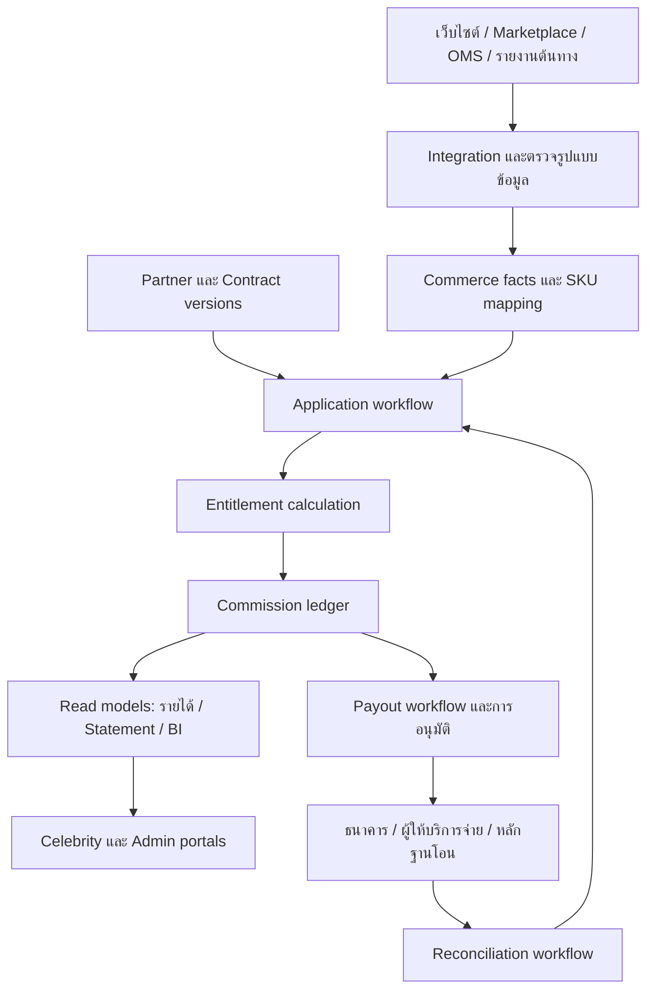

# รายงานวิจัยและแนวทางออกแบบ Celebrity Partnership & Revenue Share Portal

**สำหรับ:** บริษัทจำหน่ายผลิตภัณฑ์เสริมอาหารและ healthcare ผ่าน e-commerce, social commerce และ marketplace  
**วันที่ศึกษา:** 6 กันยายน 2026 — ประเทศไทยเป็นตลาดหลัก  
**สถานะ:** รายงานวิจัยและข้อเสนอเพื่อพิจารณา ยังไม่ใช่แบบระบบที่อนุมัติให้พัฒนา  
**ขอบเขตหลักฐาน:** เอกสารผลิตภัณฑ์ คู่มือผู้ใช้งาน API และหน่วยงานทางการ 37 แหล่ง ไม่ได้เข้าทดลองบัญชีสมาชิกหรือเชื่อมข้อมูลร้านค้าจริง

## 1. ข้อเสนอสำหรับผู้บริหาร

ควรวางระบบเป็น **“พอร์ทัลคู่ค้าดาราที่อธิบายและตรวจสอบเงินได้”** มีแกนกลางเป็นกติกาสัญญา ยอดขายที่ตรวจสอบย้อนกลับได้ และบัญชีส่วนแบ่งรายบุคคล เป้าหมายไม่จบที่การแสดงยอดขาย แต่ต้องตอบได้ว่า **ดาราได้สิทธิ์จากอะไร ได้เท่าไร ยอดไหนยังเปลี่ยนได้ จ่ายเมื่อไร และเงินที่ได้รับตรงกับรายการใด**

ในฝั่งบริษัท ระบบต้องตอบเพิ่มว่า **แคมเปญนี้สร้างกำไรหลังหักส่วนแบ่งจริงหรือไม่ และบริษัทมีเงินสดพอจ่ายตามสัญญาหรือไม่** ยอดขายที่แพลตฟอร์มโฆษณารายงาน ยอดขายที่ใช้คิดส่วนแบ่ง และเงินโอนเข้าบริษัทเป็นคนละตัวเลข

แนวทางที่แนะนำเบื้องต้นคือ **Hybrid: พอร์ทัลของแบรนด์ + บัญชีส่วนแบ่งกลาง + เชื่อมข้อมูลจากระบบขายเดิมและรายงานของแต่ละแพลตฟอร์ม** ใช้เครื่องมือสำเร็จรูปในส่วนที่ทำได้ดีอยู่แล้ว เช่น authentication, เก็บเอกสาร, รับข้อมูล affiliate หรือส่งไฟล์ให้บัญชี โดยให้บริษัทเป็นเจ้าของกติกาสัญญาและ statement ที่ใช้ตกลงกับดารา

เหตุผลคือการขายข้าม marketplace และแชตมีข้อจำกัดด้านข้อมูลต่างกัน ขณะที่สัญญาคนดังอาจรวมทั้งค่าจ้าง ผลตอบแทนตามยอด สิทธิ์ใช้ภาพ และผู้จัดการ ระบบ Affiliate อย่างเดียวอาจไม่ครอบคลุม แต่การสร้างทุกอย่างใหม่ก่อนพิสูจน์แคมเปญก็เพิ่มต้นทุนเกินจำเป็น

สิ่งที่ควรมีตั้งแต่รุ่นแรก:

1. ดาราและผู้จัดการเข้าใช้ด้วยบัญชีของตน เห็นเฉพาะสิทธิ์ที่ได้รับ
2. แยกยอดประมาณการ ยอดยืนยันรอจ่าย และยอดจ่ายแล้ว พร้อมที่มาและวันอัปเดต
3. เปิดดูสูตรส่วนแบ่งและประวัติสัญญาที่ใช้กับแต่ละรายการได้
4. รองรับยกเลิก คืนบางชิ้น คืนย้อนหลัง และค่าคอมที่ marketplace จ่ายให้แล้ว
5. บริษัทตรวจยอดกับรายงานต้นทางก่อนอนุมัติจ่าย และมีหลักฐานยืนยันการโอน
6. มีชุดเนื้อหา/คำกล่าวอ้างที่ผ่านการตรวจสำหรับสินค้า healthcare

สิ่งที่ควรชะลอจนมีเหตุผลจากการใช้งานจริง: ระบบค้นหาดาราขนาดใหญ่, marketplace เปิดรับทุกคน, กระเป๋าเงินที่ผู้ใช้ฝากถอนเอง, AI ตัดสินส่วนแบ่ง, microservices หลายชุด และการจัดอันดับดาราแบบสาธารณะ

### สมมติฐานและข้อมูลที่ยังไม่ทราบ

ทราบแล้วว่าบริษัทขาย healthcare หลายกลุ่ม ผ่านหลายช่องทาง และต้องการให้ดาราดูส่วนแบ่งของตนเอง แต่ยังไม่ทราบจำนวนดารา จำนวนร้านค้า ยอดขาย สัดส่วน COD ระบบ OMS/ERP ที่ใช้อยู่ นิติบุคคลคู่สัญญา งบประมาณ และสิทธิ์ API ที่มีจริง

ยังไม่ได้รับคำยืนยันว่าจะแบ่งเฉพาะยอดจากลิงก์/โค้ด หรือแบ่งยอดสินค้าที่ร่วมแบรนด์ทั้งหมด รายงานจึงวิเคราะห์ **ทั้งสองแบบและแบบผสม** ตัวเลขทางธุรกิจที่ใช้สาธิตทั้งหมดเป็นสมมติฐาน ไม่ใช่ยอดจริงหรืออัตรามาตรฐานของวงการ

คำว่า “collab” ในรายงานหมายถึงการร่วมแคมเปญ/ร่วมแบรนด์ ไม่ได้สมมติว่าดาราเป็นผู้ถือหุ้นหรือมีกรรมสิทธิ์ในบริษัท

## 2. ระบบที่มีแนวคิดใกล้เคียง และสิ่งที่ควรเรียนรู้

| ระบบ/กลุ่ม | ความสามารถที่พบจากแหล่งทางการ | สิ่งที่นำมาใช้เป็นแนวทาง | ข้อจำกัดต่อโจทย์นี้ |
|---|---|---|---|
| Shopify Collabs | ลิงก์/โค้ด, คอมมิชชั่น, ช่วงพักยอด, ข้อพิพาท และจ่ายผ่านระบบ | แยกเงินที่ยังรอคืนสินค้าจากเงินที่เข้าสู่รอบจ่าย | เหมาะกับบริบท Shopify; ไม่ใช่หลักฐานว่าเชื่อมยอด Shopee/Lazada/แชตได้ครบ |
| impact.com | สัญญาและกำหนดจ่าย, pending/locked actions, tracking และ bonus ตามแผน | แสดงวันที่ยอดล็อกและกำหนดจ่ายที่ตรวจจากสัญญาได้ | ความสามารถต่างกันตาม package; ต้องพิสูจน์ Thai marketplace และค่าบริการ |
| Refersion | พอร์ทัลรายบุคคล, รายงาน SKU/SubID, สูตรค่าคอม, SKU royalty | ใกล้ทั้ง affiliate และสินค้าที่ดาราร่วมแบรนด์ | SKU royalty ต้องเปิดใช้งาน และอาจให้เครดิตซ้ำกับลิงก์/โค้ด |
| Everflow | Partner dashboard, offers, tracking tools, reports, billing | รวมการดูผลงานและเครื่องมือทำยอดไว้ใกล้กัน | เมนูสำหรับนักการตลาดมืออาชีพค่อนข้างมาก; ดาราอาจไม่ต้องเห็นทั้งหมด |
| GRIN | จัดการความสัมพันธ์ครีเอเตอร์ เนื้อหา และการจ่าย | รวมงานส่งคอนเทนต์กับรายได้ และมีกรณีรับเงินผ่าน agent | คู่มือเก่าบางหน้าค้นเจอแต่เปิดไม่ได้; ต้องแยก GRIN Classic/Gia และตรวจ demo |
| TikTok Shop Affiliate | ยอดประมาณการ/ยอดจริง, คืนบางส่วน, settlement, creator/seller APIs | ใช้ข้อมูล native สำหรับยอดและส่วนแบ่งที่เกิดใน TikTok | สิทธิ์ร้านค้าไม่เท่ากับสิทธิ์ครีเอเตอร์; วันที่ settlement ขึ้นกับร้าน |
| Shopee Affiliate | รายงานผล สินค้า/ลิงก์ และข้อตกลง Affiliate/MCN | ศึกษาการแยกผลงานและค่าคอมของโปรแกรมภายในแพลตฟอร์ม | ยังไม่ยืนยัน API ที่บริษัทจะเข้าถึงและความละเอียดระดับดารา |
| Lazada Affiliate / Sponsored Solutions | โปรแกรม affiliate, คืน affiliate fee เมื่อมีคืนสินค้า, seller finance APIs | กระทบยอดคำสั่งซื้อกับรายการการเงินที่เกิดจริง | Seller finance ไม่ได้พิสูจน์ว่าอ่านค่าคอมของ affiliate ทุกรายได้ |
| RoyaltyZone | รายงานยอดขาย/คืน/ยอดยกเว้น, advance, minimum guarantee | ใกล้โมเดลร่วมแบรนด์หรือให้สิทธิ์ใช้ชื่อและภาพตามยอด SKU | คู่มือเก่าใช้เป็นแนวคิด royalty reporting; ไม่ถือว่าได้ตรวจฟีเจอร์และราคาใหม่ทั้งหมด |

แหล่งอ้างอิง: [Shopify payments][S01], [impact pending actions][S02], [Refersion portal][S03], [Refersion SKU royalties][S04], [Everflow onboarding][S06], [GRIN features][S07], [GRIN payables][S08], [TikTok commission][S10], [Shopee reports][S14], [Shopee terms][S15], [Lazada finance][S16], [Lazada returned orders][S17], [RoyaltyZone reporting][S09]

### ข้อค้นพบที่มีผลต่อการตัดสินใจ
**Affiliate กับ Royalty ต้องแยกเป็นคนละสิทธิ์** Refersion ระบุว่า SKU promotion ให้เครดิตทุกครั้งที่สินค้านั้นขายได้ และเตือนว่าคำสั่งซื้อเดียวอาจได้รับเครดิตซ้ำหากมี link/code ร่วมด้วย ข้อเสนอของเราคือสัญญาต้องบอกอย่างชัดเจนว่า “ให้เพิ่มกัน”, “เลือกอย่างใดอย่างหนึ่ง” หรือ “หักกลบ” ก่อนระบบคิดเงินจริง [Refersion SKU royalties][S04]

**วันยืนยันยอดกับวันได้เงินเป็นคนละวัน** impact แสดง locking date และ payment schedule แยกกัน ส่วน Shopify มี holding period ก่อนกระบวนการเรียกเก็บและจ่าย ดังนั้นหน้า “รายได้” ต้องมีทั้งสถานะและกำหนดการ ไม่ควรมีตัวเลขก้อนเดียวชื่อ “รายได้รวม” [impact pending actions][S02], [Shopify payments][S01]

**ข้อมูลสำหรับทำงานสำคัญพอ ๆ กับกราฟ** Refersion ให้ลิงก์ สื่อโปรโมต ข้อตกลง และประวัติการจ่าย ส่วน Everflow รวม offers/tracking/reporting/billing ข้อเสนอคือดาราควรเข้ามาแล้วทำสิ่งต่อไปได้ เช่น คัดลอกลิงก์ ส่งงาน หรือแก้ข้อมูลรับเงิน [Refersion portal][S03], [Everflow onboarding][S06]

**รายงาน royalty ต้องอธิบายส่วนหักและเงินล่วงหน้า** RoyaltyZone แสดงยอดขายสุทธิ รายการคืน ยอด advance ที่หักคืน และความคืบหน้าต่อ minimum guarantee เหมาะกับการออกแบบ statement สำหรับดาราที่มีข้อตกลงเฉพาะ [RoyaltyZone reporting][S09]

## 3. Business model: ควรแบ่งผลประโยชน์อย่างไร

ตารางต่อไปนี้เป็นการวิเคราะห์สำหรับธุรกิจนี้ ไม่ใช่การเสนออัตราที่ใช้ได้กับดาราทุกคน

| โมเดล | ฐานคิด | เหมาะเมื่อ | ข้อดี | ความเสี่ยง/ข้อกำหนด |
|---|---|---|---|---|
| Affiliate revenue share | ยอดที่ระบุได้ว่ามาจาก link/code/content ของดารา | ทดลองตลาด วัดผลตรง มีช่องทางรองรับ tracking | เชื่อมผลตอบแทนกับยอดที่พิสูจน์ได้ | ยอดดูคลิปแล้วไปซื้อเองอาจไม่ถูกนับ; โค้ดรั่ว |
| Campaign/SKU revenue share | ยอดสินค้าหรือชุดสินค้าในขอบเขตสัญญา | มีสินค้าร่วมแบรนด์หรือดาราสร้าง demand ในวงกว้าง | ครอบคลุมยอดที่ไม่ได้ผ่านลิงก์ | ต้องกำหนดร้าน ประเทศ ช่วงเวลา สินค้า และยอดเดิมที่รวม |
| Fixed fee + revenue share | ค่างานที่ตกลง + ส่วนแบ่งยอด | ต้องการล็อกจำนวนโพสต์/ไลฟ์และคุณภาพงาน | ดารามีความแน่นอน บริษัทมีแรงจูงใจด้านผลลัพธ์ | Fixed fee อาจทำให้คืนทุนช้า ต้องประเมินแยกจากรายได้ผันแปร |
| Minimum guarantee | อย่างน้อย G ต่อระยะสัญญา หรือส่วนแบ่งสะสมหากสูงกว่า | ดารามีอำนาจต่อรองและให้สิทธิ์ชัด | แชร์ upside โดยมีรายได้ขั้นต่ำ | ต้องกำหนดวิธีหักกลบ ไม่คิด G บวกส่วนแบ่งโดยอัตโนมัติ |
| Recoupable advance | จ่าย A ล่วงหน้า แล้วหักจากส่วนแบ่งในอนาคต | ดาราต้องการเงินก่อนเริ่ม | ลดภาระเงินล่วงหน้าที่จ่ายเพิ่มซ้ำ | ต้องมีบัญชี advance แยกและเงื่อนไขเมื่อยอดไม่ถึง |
| Contribution/profit share | กำไรหลังหักต้นทุนที่สัญญาระบุ | มีคู่ค้าร่วมลงทุนและเปิดต้นทุนให้ตรวจ | ป้องกันแคมเปญขายมากแต่ขาดทุน | มีข้อพิพาทง่ายเรื่องค่าแอด overhead และการปันส่วน |
| Equity / joint venture | สิทธิ์หุ้นและผลตอบแทนตามโครงสร้างธุรกิจ | ตั้งธุรกิจร่วมจริง | ผูกแรงจูงใจระยะยาว | เป็นโครงสร้างกฎหมาย/บัญชีอีกประเภท ไม่ใช่เพียงตั้ง % ใน dashboard |

### แนวทางที่เสนอ

เริ่มด้วย **ส่วนแบ่งจากยอดขายสุทธิที่นิยามในสัญญา** และให้เลือก scope ว่าเป็น attributed sales หรือ all eligible SKU sales ถ้าต้องการจ้างผลิตคอนเทนต์ให้มี fixed fee เป็นบรรทัดแยก ใช้โบนัสเป็นช่วงแบบคิดเฉพาะส่วนเกินเพื่อให้ต้นทุนคาดการณ์ง่าย

สำหรับแคมเปญร่วมแบรนด์ที่เกิดจริง อาจมี SKU royalty เป็นฐาน และ affiliate bonus เพิ่มเฉพาะยอดที่ดาราช่วยปิดได้ แต่ต้องคำนวณกำไรรวมของสองสิทธิ์ก่อนตกลง ไม่ควรเปิดทั้งสองสูตรเพียงเพราะแพลตฟอร์มรองรับ

ไม่แนะนำ profit share เป็นค่าเริ่มต้น เพราะดาราตรวจสอบยอดขายได้ง่ายกว่าตรวจต้นทุนทั้งหมดของบริษัท หากเลือกจริงต้องแจกแจง allowable costs, วิธีปันส่วนค่าโฆษณา, การอนุมัติงบ และสิทธิ์ตรวจบัญชี

### ตัวอย่างโบนัสที่ต่างกันมากแม้ใช้คำว่า tier เหมือนกัน

สมมติฐาน: ยอดฐาน 600,000 บาท; ช่วงแรก 500,000 บาทได้ 10%; ส่วนเกินได้ 15%

- แบบ marginal: 500,000 × 10% + 100,000 × 15% = **65,000 บาท**
- แบบ retroactive: เมื่อถึงเกณฑ์ คิด 600,000 × 15% = **90,000 บาท**

ต่างกัน 25,000 บาท ระบบต้องเก็บวิธีคิด ช่วงเวลา reset และวิธีจัดการยอดคืนที่ทำให้หลุด tier ไว้ในสัญญาเดียวกัน

### Business model ของตัวระบบ

ในระยะแรกระบบเป็นเครื่องมือดำเนินงานของบริษัท ผลตอบแทนมาจากลดเวลาปิดยอด ลดเงินจ่ายผิด เพิ่มความเชื่อมั่นของดารา และช่วยจัดงบให้แคมเปญที่มีกำไร บริษัทไม่จำเป็นต้องเก็บค่าระบบจากดารา

หากวันหนึ่งขายระบบให้แบรนด์อื่น ค่อยพิจารณา SaaS ค่ารายเดือนตามจำนวนคู่ค้า/ร้านค้า + ค่าติดตั้ง connector โดยแยกต้นทุนการจ่ายเงินออกมา แต่การทำ multi-tenant SaaS ไม่ใช่ขอบเขตที่จำเป็นต่อแคมเปญแรก

## 4. เรื่องที่สัญญาต้องนิยามก่อนคิดส่วนแบ่ง

| หัวข้อ | ข้อตกลงที่ต้องบันทึกได้ในระบบ |
|---|---|
| คู่สัญญาและผู้รับเงิน | ดาราบุคคลธรรมดา บริษัทของดารา หรือเอเจนซี; ผู้มีสิทธิ์ดูไม่จำเป็นต้องเป็นผู้รับเงิน |
| สิทธิ์ที่ได้รับ | Affiliate, SKU royalty, ค่าผลิตงาน, ค่าใช้ภาพ, bonus, minimum guarantee, advance |
| ขอบเขตสินค้า | SKU/variant/bundle ที่รวมและยกเว้น; mapping ข้ามร้าน; การเปลี่ยนรหัสสินค้า |
| ขอบเขตการขาย | ร้านค้า ช่องทาง ประเทศ สกุลเงิน; รวม reseller/wholesale หรือไม่ |
| เวลา | วันเริ่ม–สิ้นสุด, timezone, event ที่ใช้ตัดสิทธิ์ เช่น paid_at หรือ delivered_at |
| ฐานยอดขาย | ก่อน/หลังส่วนลด, ไม่รวม VAT หรือรวม, ค่าขนส่ง, platform subsidy และ gift card |
| ต้นทุนที่หัก | หัก platform fee/ค่าแอดหรือไม่; ห้ามอนุมานจากคำว่า “net” |
| การซื้อซ้ำ | เฉพาะครั้งแรก, ภายใน N วัน, subscription กี่งวด หรือ SKU royalty ตามอายุสัญญา |
| Attribution | ลิงก์ชนโค้ด, creator ชน creator, live ชน ad, manual credit และโค้ดเผยแพร่ต่อ |
| หลายสิทธิ์พร้อมกัน | รวมกัน, exclusive, split หรือ top-up; marketplace จ่ายแล้วหักกลบอย่างไร |
| คืน/ยกเลิก/ทุจริต | คืนบางชิ้น, หลังจ่ายแล้ว, COD ไม่รับ, dispute และหลักฐาน |
| วันที่จ่าย | รอบปิดยอด, วันยืนยัน, วันครบกำหนด, วันหยุด, ค่าโอนและเอกสารไม่ครบ |
| ภาษี | ประเภทค่าตอบแทน ผู้รับเงิน สถานะ VAT และผู้รับผิดชอบเอกสาร |
| Content/IP | จำนวนงาน, รอบแก้, approval, ช่องทางเผยแพร่, usage period, Spark/partnership ads, music rights |
| การสิ้นสุด | หยุดงานใหม่เมื่อไร, trailing sales, sell-off stock, จ่ายยอดค้าง, อ่านประวัติย้อนหลัง |
| ข้อพิพาท | ช่องทางแจ้ง กำหนดเวลาตอบ ผู้ชี้ขาด สิทธิ์ audit และการแก้ statement |

ควรแสดง “สรุปข้อตกลงอ่านง่าย” คู่กับเอกสารลงนาม และผูกทุกการคำนวณกับ contract version ห้ามให้การแก้ % วันนี้ย้อนเปลี่ยนยอดเก่าที่ปิดแล้วอย่างเงียบ ๆ

**การซื้อซ้ำต้องคำนึงถึงคุณภาพข้อมูล:** ลูกค้าซื้อบนเว็บไซต์แล้วไปซื้อใน marketplace อาจเชื่อมตัวบุคคลไม่ได้ ให้แสดง “ลูกค้าใหม่ในช่องทางที่ตรวจสอบได้” แทนการอ้างว่าเป็นลูกค้าใหม่ทั้งบริษัท

## 5. การระบุยอดขายของดาราข้ามช่องทาง

### 5.1 แยกข้อเท็จจริงสามชุด

1. **Sales facts:** ขายอะไร ที่ร้านไหน จำนวนเงินเท่าไร คืนไปเท่าไร — จาก order/finance ต้นทาง
2. **Marketing attribution:** touchpoint ใดได้รับเครดิตทางการตลาด — อาจมีหลายเครื่องมือและเปลี่ยนตามโมเดล
3. **Contract entitlement:** ตามสัญญาบริษัทติดหนี้ดาราเท่าไร — คำนวณด้วยกติกาที่ตกลงและตรวจสอบได้

Google Analytics อธิบายว่า attribution เป็นการจัดสรรเครดิต และบางผลอาจถูกจัดสรรใหม่ภายหลัง จึงไม่ควรให้การเปลี่ยนโมเดลใน analytics เปลี่ยนเงินที่ตกลงจ่ายไปแล้วโดยตรง ข้อนี้เป็นข้อสรุปเชิงออกแบบจากลักษณะของแหล่งข้อมูล [Google Analytics attribution][S29]

### 5.2 ความสามารถและหลักฐานที่ต้องใช้ตามช่องทาง

| ช่องทาง | หลักฐานที่ใช้ได้ | วิธีเชื่อมที่เสนอ | สิ่งที่ยังต้องพิสูจน์ |
|---|---|---|---|
| เว็บไซต์แบรนด์ | order, line item, code, first-party referral ID | webhook + API reconciliation | ระบบขายรองรับข้อมูลใด, consent, cross-device loss |
| Facebook/IG/LINE ที่ปิดผ่านแอดมิน | order ID ใน OMS + campaign/referral ที่ส่งต่อมาจากแชต | บันทึก referral ตอน lead เข้าและผูกเมื่อสร้างออเดอร์ | การเชื่อมแชตกับ order และสิทธิ์ของแต่ละช่องทาง |
| TikTok Shop | native affiliate order และ finance settlement | seller/creator API ที่อนุมัติ หรือรายงาน export | scopes, market eligibility, field-level mapping, payor |
| Shopee | รายงาน affiliate/MCN และ order/finance ของร้านตามสิทธิ์ | official export ก่อน; API เมื่อยืนยันเข้าถึงได้ | ยังไม่พิสูจน์ว่า seller app อ่าน creator commission ได้ |
| Lazada | order/transaction/payout และ affiliate report ตามโปรแกรม | finance API + export ที่มีสิทธิ์ | การจับคู่ creator กับ order และขอบเขตข้อมูลไทย |
| COD/โทรศัพท์ | OMS order + หลักฐานส่งมอบ/เก็บเงิน | import/sync จาก OMS หรือ courier ที่บริษัทใช้ | ยอดสั่งกับยอดเก็บเงินจริงต่างกันอย่างไร |
| สินค้าร่วมแบรนด์ทุกช่องทาง | eligible SKU sales ตามสัญญา | mapping SKU + finance reconciliation | ไม่จำเป็นต้องมี referral แต่ต้องไม่ตกหล่นร้านหรือ bundle |

TikTok มี API และ authorization แยกฝั่ง seller/creator/partner และคู่มือ affiliate ระบุการขอเปิดสิทธิ์ ส่วน Lazada แสดง API รายการการเงินของ seller ข้อมูลเหล่านี้พิสูจน์ความเป็นไปได้เชิงผลิตภัณฑ์ ยังไม่พิสูจน์ว่าบัญชีบริษัทนี้ใช้ได้แล้ว [TikTok integration][S12], [TikTok developer guide][S13], [Lazada finance][S16]

**UTM หรือลิงก์กลางเพียงอย่างเดียวไม่รับประกันการระบุออเดอร์เมื่อผู้ซื้อย้ายเข้าแอป marketplace** ต้องมี native attribution หรือข้อมูลจับคู่ที่ได้รับอนุญาต ถ้าไม่มีให้บอกว่า “ยังระบุไม่ได้” ไม่สร้างตัวเลขเครดิตจากการคาดเดา

### 5.3 กติกาตัวอย่างสำหรับช่องทางที่บริษัทควบคุมเอง

เป็นข้อเสนอให้เจรจา ไม่ใช่กติกาของทุกแพลตฟอร์ม:

1. ประเมินสิทธิ์ royalty จาก SKU แยกไว้ก่อน
2. ประเมิน affiliate จากหลักฐานที่ถูกต้องตามสัญญา เช่น explicit code ก่อน qualified referral
3. หากมีหลาย referral ให้ใช้ priority/window/version ที่สัญญาระบุ
4. ใช้ stacking policy ตัดสินว่า royalty และ affiliate เพิ่มกันหรือเลือกอย่างใด
5. ถ้าไม่มีหลักฐานเพียงพอ ให้เข้า unattributed/review queue; การให้เครดิตมือมีผู้อนุมัติและเหตุผล

สำหรับ native marketplace ให้ยึดคำตัดสินเครดิตภายในโปรแกรมนั้นตามข้อมูลต้นทาง การที่บริษัทอยากใช้กติกาอื่นหมายถึง “ส่วนแบ่งเพิ่มของบริษัท” ซึ่งต้องเป็นรายการแยก

### 5.4 ป้องกันการนับซ้ำอย่างเป็นระบบ

- ออเดอร์เดียวอาจปรากฏใน marketplace, OMS และ dashboard โฆษณา ให้มี canonical order identity และตาราง external aliases
- การคืนเงินต้องอ้างอิง order line เดิม ไม่ลบยอดขายเดิมทิ้ง
- Native affiliate fee กับ royalty ของดาราอาจเป็นภาระจริงทั้งคู่ ไม่ควรลบทิ้งว่า duplicate โดยไม่มีสัญญารองรับ
- ถ้า native payout เป็นส่วนหนึ่งของผลตอบแทนเดียวกัน ต้อง match ผู้รับ สัญญา ออเดอร์ สกุลเงิน และงวดก่อนหักกลบ
- ข้อมูลโฆษณาหลายแพลตฟอร์มอาจรายงานยอดเดียวกัน จึงห้ามรวม attributed revenue ทุกแหล่งเป็นรายได้บริษัท

ตัวอย่าง: บริษัทตกลง total reward 150 บาทต่อรายการ และมี native reward 80 บาทที่ตรวจยืนยันว่าเป็นภาระเดียวกันแล้ว บริษัทจ่าย top-up 70 บาท ถ้า 80 บาทนั้นเป็นคนละสิทธิ์ ให้คิดตาม stacking clause แทน

## 6. วงจรยอดขาย ส่วนแบ่ง และการจ่ายเงิน

### สถานะที่ควรแยก

| ชั้นข้อมูล | สถานะตัวอย่าง | ความหมาย |
|---|---|---|
| ออเดอร์ | created / paid / shipped / delivered / canceled / refunded | สถานะการขายและบริการหลังขาย |
| สิทธิ์ส่วนแบ่ง | estimated / pending-validation / approved / reversed / disputed | บริษัทประเมินหรือยืนยันสิทธิ์แล้วหรือยัง |
| ข้อจำกัดการจ่าย | reserve / missing-documents / investigation | ยอดมีเหตุที่ยังจ่ายไม่ได้; ไม่เปลี่ยนเป็นยอดศูนย์ |
| การโอน | unscheduled / scheduled / submitted / paid / failed / unknown | กระบวนการโอนจริง; unknown ต้องตรวจสอบก่อน retry |

ไม่ควรบังคับทุกอย่างอยู่ใน status เดียว เช่น “approved แต่เอกสารยังไม่ครบ” เป็นภาวะที่ต้องอธิบายได้

### เส้นทางปกติ

รับออเดอร์ → ตรวจสินค้า/สัญญา/ที่มา → สร้างยอดประมาณการ → รับข้อมูลส่งมอบและคืนสินค้า → กระทบยอดต้นทาง → อนุมัติส่วนแบ่ง → สร้าง statement → ตรวจเอกสารและอนุมัติจ่าย → ส่งคำสั่งโอน → ตรวจหลักฐาน → แสดงจ่ายแล้ว

**ข้อเสนอเรื่อง COD:** อาจแสดงประมาณการหลังรับออเดอร์ แต่การยืนยันส่วนแบ่งต้องใช้เงื่อนไขส่งมอบ/เก็บเงินตามสัญญา ส่วนยอดเงินสดบริษัทควรตรวจจาก remittance จริง หากสัญญากำหนดต้องจ่ายดาราก่อน platform settle ต้องแสดงเป็นความต้องการเงินทุนหมุนเวียน ไม่เลื่อนวันจ่ายเอง

### ข้อค้นพบเรื่อง TikTok settlement

คู่มือ Affiliate Commission วันที่ 19 ก.พ. 2026 ยังมีตาราง 7/3/15 วัน แต่หน้า Payment Settlement ประเทศไทยวันที่ 8 ก.ค. 2026 ระบุ 1/3/8/15 วันตามเงื่อนไขร้าน จึงใช้หน้าที่ใหม่กว่าเป็นข้อมูลอ้างอิงเรื่องรอบจ่าย และให้ดูสถานะร้านจริง ไม่ฝังตัวเลขชุดใดเป็นค่าถาวร [TikTok commission][S10], [TikTok settlement][S11]

### รายการแก้ไขที่ต้องรองรับ

- คืน 1 ชิ้นจากออเดอร์หลายชิ้น: reverse เฉพาะฐานและอัตราของชิ้นนั้น พร้อมส่วนลดที่ปันให้ชิ้นนั้น
- คืนหลังจ่ายแล้ว: เพิ่ม adjustment เชื่อม statement เดิมและหักงวดถัดไปตามสัญญา; ไม่แก้ paid history
- ยอดขายมาช้า: บันทึกทั้งวันเกิดรายการและวันที่รับข้อมูล แล้วทำ prior-period adjustment
- เปลี่ยน % กลางแคมเปญ: ใช้ effective time และ event ที่สัญญากำหนด
- โอน timeout: ตรวจ reference กับธนาคาร/ผู้ให้บริการก่อนส่งใหม่
- สัญญาสิ้นสุด: ปิดสิทธิ์ใหม่ตามข้อตกลง แต่คงการดู statement และจ่ายยอดค้าง
- มีข้อพิพาทบางรายการ: จ่ายส่วนที่ไม่พิพาทได้หากสัญญาอนุญาต

## 7. ผู้ใช้และฟีเจอร์ที่ควรมี

### 7.1 บทบาทและสิทธิ์

| บทบาท | งานหลัก | การเข้าถึงที่เสนอ |
|---|---|---|
| ดารา | ตรวจรายได้ เงื่อนไข งานที่ต้องส่ง และเอกสารรับเงิน | เฉพาะตัวเอง/นิติบุคคลและสัญญาที่เกี่ยวข้อง |
| ผู้จัดการ/เอเจนซี | ดูหลายดาราที่ได้รับมอบหมาย ประสานงาน | ต้องมี delegation แยกรายบุคคล; ถอนสิทธิ์ได้ |
| Partnership manager | จัดสัญญา งาน สื่อ และดูผลงาน | แก้ proposed terms; ไม่อนุมัติโอนเองโดยอัตโนมัติ |
| Finance preparer | นำเข้ารายงาน กระทบยอด เตรียม statement | เตรียมยอดและหลักฐาน |
| Finance approver | ตรวจและอนุมัติจ่าย/ปรับยอด | แยกจากผู้เตรียมและผู้แก้บัญชีรับเงิน |
| Compliance/content reviewer | ตรวจข้อความและสิทธิ์ใช้สื่อ | ไม่ต้องเห็นข้อมูลธนาคารหรือประวัติสุขภาพลูกค้า |
| ผู้บริหาร | กำไร ความเสี่ยง เงินสด และภาพรวมคู่ค้า | aggregate และ drill-down ตามหน้าที่ |
| ผู้ดูแลเทคนิค | ดูงานเชื่อมต่อและการทำงานระบบ | ไม่ต้องมีสิทธิ์อ่านเอกสารการเงินทั้งหมดเป็นค่าเริ่มต้น |

แยก “คนที่ login”, “บุคคล/บริษัทผู้ได้สิทธิ์”, และ “บัญชีที่รับเงิน” เป็นคนละ entity เพื่อรองรับผู้จัดการหรือบริษัทของดาราอย่างถูกต้อง

### 7.2 ฟีเจอร์ฝั่งดารา

**P0 — จำเป็นต่อการเริ่มใช้และตรวจเงิน**

- Invitation-only onboarding, เข้าระบบง่าย, recovery และจัดการ session
- หน้าเงินสรุป: ประมาณการ / ยืนยันรอจ่าย / กำหนดจ่าย / จ่ายแล้ว
- รายการส่วนแบ่งพร้อมสินค้า ช่องทาง วันที่ ฐานคิด อัตรา สถานะ และเหตุผลการปรับ
- หน้าสัญญา: สูตร ช่วงเวลา ขอบเขต และเอกสารฉบับที่ลงนาม
- Statement รายงวดและไฟล์ดาวน์โหลด; ยอดรวมตรงกับหน้ารายละเอียด
- ประวัติการจ่ายและเอกสารภาษีที่บริษัทออก
- โปรไฟล์ผู้รับเงินและกระบวนการเปลี่ยนข้อมูลที่ตรวจสอบตัวตนได้
- ช่องทางแจ้งยอดผิดพร้อมเลขอ้างอิง และเจ้าหน้าที่ดูแลที่ระบุชัด
- ลิงก์/โค้ด/สื่อที่ได้รับอนุมัติ ถ้าใช้โมเดล affiliate

**P1 — เพิ่มความสามารถในการทำยอดและลดงานประสาน**

- งานที่ต้องส่ง ปฏิทินโพสต์ สถานะตรวจคอนเทนต์ และวันหมดอายุ usage rights
- ผลงานตามสินค้า ช่องทาง และ content ID เท่าที่ข้อมูลเชื่อถือได้
- โบนัสและความคืบหน้าถึง tier พร้อมสูตรและช่วงเวลาที่นับ
- ผู้จัดการดูหลายดาราโดยไม่แชร์รหัสผ่าน
- แจ้งเตือนเมื่อ statement ออก จ่ายสำเร็จ เอกสารขาด หรือมีงานต้องแก้
- สรุปภาษาไทยก่อนเปิดรายละเอียดทางบัญชี

**P2 — หลังมีข้อมูลและปัญหาจริงรองรับ**

- คาดการณ์รายได้เป็นช่วง พร้อม assumptions
- คำแนะนำสินค้า/เนื้อหาจากประวัติผลงานที่มากพอ
- การต่อสัญญาแบบจำลองหลายทางเลือก
- หลายประเทศ หลายสกุลเงิน และหลายแบรนด์ภายใต้กลุ่มบริษัท

### 7.3 ฟีเจอร์ฝั่งบริษัท

P0 ต้องมี contract versioning, SKU mapping, import/API status, duplicate detection, commission calculation, reconciliation queue, statement generation, approval, payment reference, audit history และ permission management

P1 เพิ่ม campaign profitability, media cost allocation, budget/guarantee/advance tracking, inventory availability จาก OMS, content approval, renewal workflow และ automated payout adapter เมื่อกระบวนการมือพิสูจน์แล้ว

หลังบ้านควรแยกสองมุมมอง: **ฝ่าย partnership ดูสิ่งที่ช่วยทำยอด** และ **ฝ่าย finance ดูสิ่งที่ต้องตรวจ/จ่าย** ไม่บังคับให้ทุกคนทำงานผ่าน dashboard เดียวที่มีทุกตัวเลข

## 8. UX/UI: ควรแสดงผลแบบไหน

### 8.1 หลักคิด

ดาราควรตอบสามคำถามจากหน้าจอแรกได้ภายในเวลาสั้น: **“ตอนนี้ได้สิทธิ์เท่าไร”, “รอบต่อไปจะได้เงินเท่าไร/เมื่อไร”, “มีอะไรที่ต้องทำ”** นี่คือสมมติฐาน usability ที่ต้องทดสอบกับผู้ใช้จริง ไม่ใช่ผลทดสอบที่เกิดขึ้นแล้ว

ลำดับข้อมูลที่เสนอ: เงินที่เกี่ยวกับตน → สถานะ/กำหนดการ → สิ่งที่ต้องทำ → ผลงาน → รายละเอียด ใช้กราฟเพื่ออธิบายแนวโน้ม ไม่ให้กราฟเบียดกำหนดจ่ายและเหตุผลที่เงินยังรออยู่

### 8.2 เปรียบเทียบทิศทางหน้าตา

| ทิศทาง | ลักษณะ | เหมาะกับ | ข้อแลกเปลี่ยน |
|---|---|---|---|
| **Partner Finance — แนะนำ** | พื้นสว่าง สีแบรนด์ที่สงบ ตัวเลขชัด รายการอ่านง่าย | ดารา ผู้จัดการ บัญชีที่ต้องการความเชื่อมั่น | ต้องทำรายละเอียดสถานะและตัวเลขดีจริง |
| Campaign Studio | ภาพสินค้า คอนเทนต์ งานและเป้าหมายเด่น | ดาราที่เข้าเพื่อทำงานร่วมกับทีมบ่อย | เงินอาจถูกลดความสำคัญถ้า layout เน้นสื่อเกินไป |
| Analyst Console | ตาราง/กราฟ/filters หนาแน่น | ทีม performance และ finance ภายใน | ภาระเรียนรู้สูงบนมือถือ |

ใช้ Partner Finance เป็นหน้าดารา และใช้ Analyst Console ในหลังบ้าน ไม่จำเป็นต้องมีสอง codebase

### 8.3 โครงหน้าแรก — wireframe เชิงข้อมูล

ตัวเลขนี้เป็นตัวอย่าง UI แยกจากงบตัวอย่างในบทการเงิน และเป็นยอดสะสมทั้งแคมเปญ ณ วันที่เดียวกัน

```text
สวัสดีคุณ A           แคมเปญของฉัน ▼       อัปเดตล่าสุด 10:30 น.

ยืนยันแล้วรอจ่าย       ประมาณการที่ยังรอตรวจ       ชำระสิทธิ์แล้วสะสม*
฿55,000                ฿33,000                    ฿80,000

กำหนดจ่ายรอบถัดไป: 15 ต.ค. 2026
ยอดก่อนภาษี ฿55,000 • ยอดโอนสุทธิจะแสดงหลังตรวจเอกสาร
[ดูรายละเอียดรอบจ่าย]

สิ่งที่ต้องทำ: ตรวจ statement เดือนนี้ 1 รายการ

รายได้ตามเวลา [สัปดาห์ / เดือน]    [ดูเป็นตาราง]
สินค้าและช่องทางที่สร้างส่วนแบ่ง

[รายได้] [แคมเปญและสื่อ] [เอกสาร] [บัญชี]
*มูลค่าสิทธิ์ก่อนภาษี; ดูเงินโอนสุทธิในประวัติการจ่าย
```

ยอดยืนยันสะสมคือ 55,000 + 80,000 = 135,000 บาท โดย 80,000 เป็นมูลค่าสิทธิ์ก่อนภาษีที่ชำระแล้ว ไม่ใช่เงินสดสุทธิที่เข้าธนาคาร; ยอดประมาณการ 33,000 ยังไม่รวมในสิทธิ์ยืนยัน ห้ามบวก “ยอดยืนยันสะสม” กับ “จ่ายแล้ว” ซ้ำ และคำว่า “กำหนดจ่าย” ใช้เมื่อมีตารางจ่ายที่อนุมัติจริงเท่านั้น

### 8.4 หน้ารายละเอียดส่วนแบ่ง

ตาราง desktop: วันที่ | อ้างอิง | สินค้า | ช่องทาง | ฐานคิด | อัตรา | ส่วนแบ่ง | สถานะ

เมื่อเปิดรายการควรเห็น calculation waterfall เช่น ยอดสินค้าก่อนหัก → ส่วนลด → คืนสินค้า → ฐานตามสัญญา → อัตรา → adjustment พร้อมสัญญา version และเหตุผลที่รายการนี้ได้เครดิต

บนมือถือให้เปลี่ยนเป็นรายการการ์ดที่มีสินค้า ส่วนแบ่ง และสถานะก่อน รายละเอียดอยู่ในแผงเปิดเพิ่ม ไม่ให้ผู้ใช้เลื่อนตารางกว้างหลายสิบคอลัมน์เพื่อหาเงินของตน

### 8.5 หน้าจ่ายเงินและเอกสาร

แสดง statement number, งวดรายได้, ยอดยกมา, รายได้งวดนี้, adjustment, ยอดกันไว้ตามสัญญา, รายการหัก advance, ภาษี, net transfer, วันครบกำหนด และ bank reference ที่ปกปิดส่วนที่ไม่จำเป็น

มี timeline “เตรียมเอกสาร → อนุมัติ → ส่งโอน → ยืนยันแล้ว” หากโอนไม่สำเร็จบอกสิ่งที่ต้องทำ โดยไม่แสดง error code ธนาคารให้ดาราตีความเอง

### 8.6 หน้าหลังบ้าน

- **Finance work queue:** ยอดที่ยังจับคู่ไม่ได้, เอกสารขาด, ค้างอนุมัติ, โอนสถานะไม่แน่ชัด, overdue
- **Campaign economics:** revenue → costs → contribution → fixed commitments; แยก actual/estimated
- **Data health:** ร้านใดอัปเดตล่าสุดเมื่อไร ข้อมูลตกช่วงไหน จำนวนและจำนวนเงินที่ยังไม่ลงตัว
- **Contract preview:** ก่อนใช้ rate ใหม่ แสดงว่ากระทบใคร/ช่วงใด โดยยังไม่เขียนยอดจริง
- **Payout review:** เปรียบเทียบงวดก่อน ยอดเพิ่มผิดปกติ บัญชีรับเงินที่เพิ่งเปลี่ยน และการอนุมัติที่ต้องทำ

### 8.7 รูปแบบการแสดง metric

| ข้อมูล | รูปแบบแนะนำ | เหตุผล |
|---|---|---|
| รายได้ตามเวลา | line chart + เส้นประมาณการที่แยกชัด | เห็นการเปลี่ยนแปลงโดยไม่สื่อว่าประมาณการยืนยันแล้ว |
| รายได้แต่ละสินค้า/ช่องทาง | horizontal bar + ตาราง | เทียบตัวเลขและชื่อภาษาไทยง่าย |
| การหักจากยอดขายถึงส่วนแบ่ง | waterfall | อธิบายเงินที่หายไปแต่ละขั้น |
| สถานะรอจ่าย | stacked bar + จำนวนเงินแต่ละกลุ่ม | เข้าใจสัดส่วนและเปิดรายการต่อได้ |
| การซื้อซ้ำตาม cohort | heatmap ฝั่งบริษัท | แยกอายุลูกค้าออกจากยอดรวม |
| ภาระจ่ายตามวัน | calendar/list + cash projection | ช่วยวางเงินสดให้ตรงวันครบกำหนด |

หลีกเลี่ยง 3D chart, pie หลายชิ้น, สีอย่างเดียวในการสื่อสถานะ, dual-axis ที่ทำให้ยอดขายกับเงินดูเกี่ยวกันเกินจริง และ leaderboard ข้ามดาราที่เปิดเผยสัญญาโดยไม่จำเป็น

### 8.8 ภาษา การเข้าถึง และสถานะผิดปกติ

เสนอ body text ภาษาไทยราว 16px, line-height 1.5–1.75, ตัวเลขเรียงหลักสม่ำเสมอ, contrast ตาม WCAG 2.2 AA, keyboard focus และปุ่มแตะประมาณ 44px เป็นเป้าหมายการออกแบบ ไม่ใช่การอ้างว่า WCAG AA บังคับทุกปุ่ม 44px ใช้ status label คู่กับสี และมีตารางแทนกราฟ [WCAG 2.2][S28]

ฟอนต์ต้องทดสอบวรรณยุกต์ไทย ตัวเลขและน้ำหนักจริงก่อนเลือก; ไม่ใช้ข้อเสนอฟอนต์ละตินจากเครื่องมือออกแบบโดยอัตโนมัติ ยังไม่มี brand guideline จึงไม่ล็อกสีหรือฟอนต์เป็นแบบอนุมัติ

ต้องแยก **ไม่มีการขาย**, **ยังไม่เชื่อมข้อมูล**, **กำลังโหลด**, **ข้อมูลล่าช้า**, **ไม่มีสิทธิ์**, และ **ผิดพลาด** ออกจากกัน ไม่แสดง ฿0 เมื่อ API ล้มเหลว ควรแสดง snapshot ล่าสุดพร้อมเวลาที่เชื่อถือได้

ไม่เรียกยอด accrued ว่า “ถอนเงินได้” เว้นแต่บริษัทมีระบบ withdrawal และเงื่อนไขรองรับจริง ไม่ทำ animation ยอดเงินเด้งแบบเกมเพราะอาจทำให้ผู้ใช้เข้าใจว่ารายได้ยืนยันแล้ว

### 8.9 แผนทดสอบ UX ที่เสนอ

นำ prototype ไปทดสอบกับดารา ผู้จัดการ และ finance โดยให้ทำโจทย์: หาเงินที่จะได้รอบหน้า, อธิบายยอดลดจากคืนสินค้า, หาเงื่อนไข rate, ดาวน์โหลด statement, แจ้งรายการผิด และเปลี่ยนผู้จัดการ

เป้าหมายเสนอสำหรับการทดสอบ: ผู้ใช้ส่วนใหญ่ทำงานหลักได้โดยไม่ต้องมีคนอธิบาย, ไม่มีใครเข้าใจยอดประมาณการว่าได้รับแน่นอน, และทุกคนแยกก่อนภาษีกับยอดโอนได้ เก็บ task completion/time/error และคำถามที่ผู้ใช้ถามจริง แทนการวัดเพียงว่าสีสวยหรือไม่

## 9. เปรียบเทียบแนวทางสร้างระบบ

| ทางเลือก | โครงสร้าง | จุดแข็ง | ต้นทุน/ข้อจำกัด | เงื่อนไขเลือก |
|---|---|---|---|---|
| **A. Hybrid — แนะนำเบื้องต้น** | พอร์ทัลแบรนด์ + contract/ledger กลาง + OMS/native reports/บริการสำเร็จรูป | UX และกติกาตรงธุรกิจ; เปลี่ยนแหล่งข้อมูลได้เป็นส่วน | ต้องออกแบบ reconciliation และรับผิดชอบบัญชีกลาง | ขายหลายช่องทางและสัญญาดาราหลากหลาย |
| B. Buy-first | ใช้ SaaS affiliate/creator เป็นหลัก + export ให้บัญชี | ทดลองและเริ่มงานเร็วถ้าข้อมูลเข้ากัน | ข้อจำกัด plan, ค่าใช้จ่ายผันตามยอด, branded UX และไทย finance | ขายหลักบน platform ที่ SaaS รองรับและสูตรเรียบง่าย |
| C. Custom full platform | สร้าง portal, tracking, contract, ledger, integrations และ payout เอง | ควบคุมรายละเอียดและ roadmap สูง | เวลาพัฒนา QA การเงิน และภาระดูแลสูงสุด | มีปริมาณ/ความซับซ้อนและทีมที่พิสูจน์ว่าคุ้ม |

คำแนะนำ A เป็นสมมติฐานที่ต้องทดสอบกับข้อมูลจริง หากยอดส่วนใหญ่อยู่บน Shopify และทุกสัญญาเป็น link/code commission เรียบง่าย B อาจคุ้มกว่า หากมีเพียงไม่กี่ดาราและรายงานรายเดือนเพียงพอ การนำเข้า CSV ที่ตรวจสอบได้อาจเหมาะเป็นจุดเริ่มของ A

**เกณฑ์ตัดสินสำคัญกว่า feature list:** ทดลอง replay ชุดออเดอร์จริงที่ลดข้อมูลส่วนบุคคลแล้วให้แต่ละทางเลือก รวมคืนบางชิ้น native commission และการเปลี่ยน rate ถ้าคำนวณและกระทบยอดไม่ได้ ความสวยของ dashboard ไม่ช่วยแก้ข้อจำกัดนั้น

## 10. System architecture ที่เสนอ

### 10.1 โครงสร้างเริ่มต้น

ใช้ **modular monolith**: แอปหลักที่แบ่งโมดูลชัดเจน, worker สำหรับ import/sync/calculation/export, relational database สำหรับข้อเท็จจริงทางธุรกิจ, และ object storage สำหรับเอกสาร/ไฟล์ต้นทาง มี queue หรือ durable jobs เท่าที่งานเบื้องหลังต้องใช้

ไม่ต้องแยกทุกโมดูลเป็น microservice ตั้งแต่แรก จุดที่ควรแยก process ก่อนคือการดึงข้อมูลและสร้างรายงานหนัก เพื่อให้ API ที่ดาราเปิดดูไม่ค้างตามงาน import



แผนภาพนี้แสดง **data flow** ซึ่งมีผลการจ่ายไหลกลับมาประกอบบัญชี ไม่ใช่การกำหนดให้โมดูล import กันเป็นวงกลม ในระดับ dependency ให้ application workflows เรียก public interface ของแต่ละโมดูล; ledger ไม่เรียกธนาคารหรือย้อนเรียก UI

### 10.2 ขอบเขตและเจ้าของข้อเท็จจริง

| โมดูล | เป็นเจ้าของอะไร | รับข้อมูล | ส่งออก/สัญญาเชื่อมต่อ | เจ้าของงานธุรกิจ |
|---|---|---|---|---|
| Identity & access | user, membership, delegation, session | คำเชิญและการมอบหมายที่อนุมัติ | authorization decision ที่ scoped | ผู้ดูแลระบบและเจ้าของคู่ค้า |
| Partner & contract | payee, agreement, rule version, rights | เอกสารและข้อตกลงอนุมัติ | immutable effective terms | Partnership + Legal/Finance |
| Integration | provider connection, cursor, raw import manifest | API/webhook/ไฟล์ที่มีสิทธิ์ | normalized observations + provenance | Integration operator |
| Commerce | canonical order/line/refund, SKU alias | observations และ mapping ที่รับรอง | sales facts ตาม version | E-commerce operations |
| Entitlement | ผลคำนวณและเหตุผลตาม rule/input versions | contract + commerce facts | calculation proposal พร้อม trace | Finance policy owner |
| Commission ledger | entries/adjustments/สถานะสิทธิ์ทางการเงิน | ผลที่ผ่าน workflow อนุมัติ | balance และ movement ที่ reconcile ได้ | Finance |
| Settlement | statement, payout batch, bank reference, tax-document references | ledger ที่เข้าเกณฑ์และ approval | payout result/receipt เพื่อบันทึกต่อ | Finance + Treasury |
| Content & rights | brief, asset version, approved claims, license expiry | ทีม content และผู้ตรวจ | approved asset/usage status | Brand + Compliance |
| Reporting | projection, filter semantics, freshness | facts และ ledger | read-only partner/admin views | Product/Analytics |

ERP/บัญชีบริษัทเป็นแหล่งรับรองบัญชีทั่วไปของบริษัท ส่วน commission ledger เป็นบัญชีย่อยที่ต้องกระทบเข้ากันได้ ไม่ตั้งระบบนี้เป็นผู้แทน GL โดยปริยาย ถ้ายังไม่มี ERP ต้องระบุสมุดบัญชี/กระบวนการที่ finance รับรองก่อนใช้จริง

### 10.3 ขอบเขตสิบด้านที่ต้องรักษา

| ด้าน | ข้อเสนอและสิ่งที่ยังเปิดอยู่ |
|---|---|
| B1 System | ระบบดูแลข้อตกลง ส่วนแบ่ง และรายงาน; platform ควบคุม native attribution และธนาคารยืนยันการโอน |
| B2 Domain | แยกยอดขาย สิทธิ์ตามสัญญา การจ่าย และ content rights |
| B3 Module | แต่ละโมดูลมี public interface; ห้ามรายงานแก้ยอดเงินต้นทางเอง |
| B4 Component | parser, calculator, matcher และ renderer อยู่หลัง interface; เปลี่ยนได้พร้อมตรวจ parity |
| B5 Package/build | เริ่ม repo/build ร่วมได้; ยังไม่ต้องแยก package ตามทุกโดเมน |
| B6 Runtime | web/API แยกงาน worker; job retry ต้องไม่สร้างยอดซ้ำ |
| B7 Deployment | เริ่ม release เดียวกับ worker ที่ version compatible; ยังไม่ได้เลือก host |
| B8 Data authority | contract module รับรอง terms; commerce รับรอง normalized sales; ledger รับรองส่วนแบ่ง; bank รับรองผลโอน |
| B9 Trust | celeb/manager, finance, integration provider และเอกสารส่วนตัวเป็นขอบเขตต่างกัน; ตรวจสิทธิ์ที่ server |
| B10 Ownership | ต้องมีผู้รับผิดชอบจริงของสัญญา mapping การกระทบยอด payout และ incident; ยังไม่ได้ระบุรายชื่อ |

**สถานะความพร้อมสำหรับนำแบบไปพัฒนา: NOT READY** เพราะยังไม่รับรองสัญญา แหล่งข้อมูลจริง สิทธิ์ API และผู้รับผิดชอบ ส่วนรายงานวิจัยนี้ใช้ประกอบการตัดสินใจได้ ไม่ใช่เหตุให้หยุดการวิจัยหรือขออนุมัติซ้ำสำหรับงานรายงาน

### 10.4 หลักข้อมูลที่ห้ามผิด

- เงินแต่ละรายการต้องมี currency และ decimal/minor-unit policy ที่ชัดเจน ไม่ใช้ floating point คำนวณเงินจริง
- Rate ต้องเก็บ precision ที่ตกลงได้ และระบุปัดเศษระดับ line หรือ statement พร้อมวิธีจัดการเศษ
- บันทึก order key แบบมี platform + shop + external ID; ไม่ใช้ order number สั้น ๆ เป็น global identity
- เก็บ original event time, received time, effective time และ posting period แยกกัน
- ทุก calculation ต้องอ้าง contract version, input snapshot, source record และ calculation version
- เปลี่ยนยอดที่ยืนยันแล้วด้วย adjusting/reversing entries ที่อ้างรายการเดิม ไม่ลบประวัติ
- “Paid” ต้องมีหลักฐานผลโอนที่ reconcile แล้ว; การกดอนุมัติไม่ใช่การจ่าย
- ผู้ใช้ต่างดาราต้องไม่อ่านกันได้ แม้เปลี่ยน URL, ใช้ export หรือเปิดลิงก์เอกสารเก่า
- มีได้หลาย entitlement ต่อ order line เฉพาะเมื่อสัญญาอนุญาต ไม่ใช้ unique order ID เพียงตัวเดียวห้ามทุกการแบ่งร่วม

### 10.5 Data model ระดับแนวคิด

กลุ่ม entity ที่ควรมี:

| กลุ่ม | Entity สำคัญ | ความเชื่อมโยง |
|---|---|---|
| คู่ค้า | Partner, LegalPayee, User, Membership, Delegation | ดาราหนึ่งคนมีผู้จัดการได้หลายคนและเปลี่ยนผู้รับเงินตาม version |
| สัญญา | Agreement, AgreementVersion, Campaign, Rule, EligibleSKU | terms มีช่วงเวลาที่มีผลและลายเซ็น/approval reference |
| ยอดขาย | Shop, Order, OrderLine, RefundLine, Adjustment, SKUMap | รายการหลายแหล่ง map เข้า canonical order เดียว |
| Attribution | Referral, CodeAssignment, AttributionEvidence, AttributionDecision | แยก evidence ออกจาก decision และแยก native กับ company rule |
| การเงิน | Entitlement, LedgerEntry, Reserve, AdvanceMovement | เชื่อมต้นทางและป้องกันการคิด/หักซ้ำ |
| จ่าย | Statement, StatementLine, PayoutBatch, PayoutAttempt, Receipt, TaxDocument | payout หนึ่งรายการจ่ายหลาย entitlement; attempt ไม่ใช่ paid ใหม่ |
| งาน | Brief, Deliverable, AssetVersion, RightsGrant, Review | การใช้สื่อผูกขอบเขตและวันหมดอายุ |
| ปฏิบัติการ | ImportBatch, SyncRun, ExceptionCase, AuditEvent | ตรวจว่าใครทำอะไรกับชุดข้อมูลใด |

ควรเก็บ customer identifiers เท่าที่ต้องใช้สำหรับ dedup/การซื้อซ้ำในเขตข้อมูลที่จำกัดสิทธิ์ พอร์ทัลดาราใช้ order reference ที่ลดการระบุตัวบุคคล ไม่ต้องมีชื่อ เบอร์ ที่อยู่ หรือแชตอาการของผู้ซื้อ

### 10.6 การรับข้อมูลและความทนทาน

Webhook ไม่รับประกันว่าจะมาครั้งเดียวหรือมาเรียงตามเวลา เอกสาร Stripe กล่าวถึง duplicate/out-of-order events ส่วน Shopify แนะนำการตรวจความถูกต้องของ delivery และ reconciliation jobs ข้อเสนอคือรับข้อมูลแบบตรวจซ้ำได้ บันทึกลง durable store แล้วประมวลผลโดยมี idempotency และ backfill [Stripe webhooks][S27], [Shopify webhooks][S26]

Import CSV ควรมี preview, schema version, file hash, row count, currency/timezone, rejected rows และยอดรวมก่อนรับเข้า ไม่ให้ partial import ผ่านเงียบ ๆ และไม่ถือว่าการใช้ CSV เป็นระบบคุณภาพต่ำถ้าตรวจสอบและย้อนรอยได้

การโพสต์ ledger และบันทึกงานส่งต่อควรอยู่ใน transaction ภายในฐานข้อมูลเดียวกัน แล้วให้ worker ส่งออกอย่าง retry-safe แต่ห้ามถือว่าธนาคารหรือ marketplace อยู่ใน transaction นี้ ต้องมีสถานะ pending/unknown และ reconciliation สำหรับการข้ามระบบ

เมื่อ API ขาดช่วง ให้เก็บ last good snapshot แสดง freshness และระงับการยืนยันเฉพาะชุดยอดที่ขาดหลักฐาน ไม่ทำให้ portal ทั้งหมดใช้ไม่ได้ หากข้อผิดพลาดอยู่ใน calculator ให้หยุดการโพสต์ยอด version นั้นและ replay ใน shadow ก่อนใช้ใหม่

### 10.7 การเปลี่ยนระบบและ rollback

เริ่มด้วย historical/shadow import ที่ยังไม่สร้าง payable จริง เปรียบเทียบผลกับ finance แล้วกำหนด cutover watermark ต่อร้านและงวด ใช้ compatibility ระหว่าง schema/parser/rule version ไม่แก้ applied migration ในภายหลัง

Rollback แอปไม่เท่ากับ rollback เงิน ถ้าโพสต์ส่วนแบ่งผิดให้หยุด batch ใหม่และออก correction ที่มี trace; ถ้าโอนผิดแล้วต้องใช้กระบวนการเรียกคืน/หักกลบตามสัญญา ไม่ลบ database เพื่อทำให้หน้าจอดูเหมือนไม่เคยโอน

เงื่อนไขที่อาจทำให้ค่อยแยก service ภายหลัง: connector บางตัวล้มเหลวจนกระทบระบบอื่น, worker backlog เกินเป้าหมายอย่างต่อเนื่อง, ทีมมี ownership ต่างกันจริง หรือข้อกำหนดการเก็บข้อมูลบังคับให้แยก ไม่แยกเพียงเพราะจำนวนไฟล์เพิ่ม

## 11. Financial model และ metric ที่ต้องมี

### 11.1 นิยามตัวเลขก่อนสร้าง dashboard

| Metric | นิยามที่เสนอ | ใช้ตอบอะไร/ข้อควรระวัง |
|---|---|---|
| Gross ordered sales | มูลค่าสินค้าออเดอร์ในช่วงที่ระบุ ก่อนส่วนลด/คืน ตามนิยามบริษัท | Demand ที่เข้ามา; ไม่ใช่รายได้บัญชี |
| Net product sales | ยอดสินค้าหลังส่วนลดและคืน ไม่รวมภาษีที่เรียกเก็บแทนรัฐ | ใช้ดูธุรกิจ; subsidy/shipping ต้องกำหนดแยก |
| Commissionable sales | เฉพาะฐานที่เข้าเงื่อนไขสัญญา | อาจต่างจาก net sales เพราะ SKU/ช่องทาง/ช่วงเวลา |
| Estimated earnings | ส่วนแบ่งที่ยังไม่ผ่านเงื่อนไขยืนยัน | มองแนวโน้ม ห้ามใช้แทน payable |
| Approved earnings | สิทธิ์ที่ finance ยืนยันตามสัญญาแล้ว | ยังอาจมี reserve หรือยังไม่ถึงกำหนด |
| Outstanding liability | สิทธิ์ยืนยันสุทธิที่ยังไม่ชำระ/หักกลบ | ภาระค้าง; แยก due/overdue/held |
| Cash paid | ยอดเงินโอนสำเร็จตามวันจ่าย | ต่างจากค่าตอบแทน gross เพราะ WHT/VAT/หัก advance |
| Native paid earnings | ค่าคอมที่ platform เป็นผู้จ่ายและมีหลักฐาน | ไม่รวมเป็นหนี้บริษัทซ้ำ |
| COGS | ต้นทุนสินค้าที่ขายสุทธิพร้อมนโยบายสินค้าคืน | Gross profit ไม่ควรนับต้นทุนสินค้าคืนซ้ำ |
| Gross profit | Net sales − COGS | ยังไม่หักค่าแอด ค่าช่องทาง และส่วนแบ่ง |
| Contribution before partner | Net sales − COGS − variable channel/fulfillment/media/other costs ที่กำหนด | พื้นที่สำหรับจ่ายดาราและเหลือกำไร |
| Contribution after partner | รายการก่อนหน้า − variable partner compensation | ตรวจความคุ้มค่าก่อน fixed campaign costs |
| Campaign result | Contribution after partner − fixed campaign costs | ยังไม่ใช่กำไรสุทธิบริษัทถ้ายังไม่รวม overhead/ภาษี |

**ไม่ควรเรียก payout จาก marketplace ว่า net sales:** เงินโอนอาจหักค่าบริการ ค่าขนส่ง การปรับงวดก่อน และรายการอื่นแล้ว ควรแยกยอดขายจาก cash settlement

หลักการรับรู้รายได้ทางบัญชีขึ้นกับข้อกำหนดที่กิจการใช้และการส่งมอบภาระตามสัญญา ไม่ได้เท่ากับวันที่กดสั่งหรือวันธนาคารโอนเสมอ IFRS 15 เป็นแหล่งอ้างอิงหลักการเรื่อง amount/timing แต่ยังไม่ได้วินิจฉัยว่าบริษัทนี้ต้องใช้ IFRS/TFRS ชุดใด [IFRS revenue recognition][S35]

### 11.2 สูตรส่วนแบ่งที่อธิบายได้

สำหรับรายการ i ที่เข้าเกณฑ์:

**ฐานส่วนแบ่งᵢ = ยอดสินค้าไม่รวมภาษี − ส่วนลดที่สัญญากำหนด − คืนสินค้าที่เกี่ยวข้อง + รายการบวกที่สัญญาอนุญาต**

**ส่วนแบ่งᵢ = ปัดเศษ(ฐานส่วนแบ่งᵢ × อัตราตาม contract version) + bonus/adjustment ที่มีที่มา**

Platform subsidy ต้องแยกจากส่วนลดที่แบรนด์ออก เพราะไม่ใช่ทุกสัญญาหรือแพลตฟอร์มจะนับเหมือนกัน ตัวอย่าง TikTok กำหนดฐาน actual paid price ของ native commission ตามสูตรของตน จึงห้ามคัดลอกสูตรเว็บแบรนด์ไปแทน native commission [TikTok commission][S10]

ถ้า bundle มีสินค้า eligible และ ineligible ต้องปันส่วนราคาขาย/ส่วนลดลงแต่ละชิ้นด้วยวิธีที่สัญญารับรอง เช่นตาม standalone selling price และให้ผลรวมเท่ากับยอด bundle พร้อมกติกาปัดเศษ

### 11.3 ตัวอย่างกำไรแคมเปญ

**สมมติฐานทั้งหมดเพื่อสาธิต:** หนึ่งงวด สกุล THB, ยอดทั้งหมดในตารางไม่รวม VAT, ไม่มี platform subsidy, rate 15% ของ net eligible sales, ไม่มี royalty ซ้อน, ตัวเลขต้นทุนรับรู้ในงวดเดียวกัน

| รายการ | บาท | วิธีคิด/ขอบเขต |
|---|---:|---|
| ยอดสินค้าก่อนส่วนลด/คืน | 1,000,000 | ออเดอร์ที่อยู่ในขอบเขตตัวอย่าง |
| ส่วนลดที่แบรนด์รับภาระ | (50,000) | หักฐาน |
| คืนสินค้า | (50,000) | จำนวนหลังส่วนลด ไม่หัก discount ซ้ำ |
| **Net eligible sales** | **900,000** | ฐานส่วนแบ่งตัวอย่าง |
| ต้นทุนสินค้าสุทธิ | (270,000) | 30% ของฐาน |
| Marketplace/payment fees | (90,000) | 10%; ไม่รวม affiliate payout ในบรรทัดดาราด้านล่าง |
| Fulfillment/shipping ที่แบรนด์รับภาระ | (54,000) | 6%; ไม่ซ้ำค่าธรรมเนียมบรรทัดก่อน |
| Paid media | (135,000) | 15% |
| Other variable tools/operations | (18,000) | 2% |
| **Contribution before partner** | **333,000** | **37%** |
| ส่วนแบ่งดารา 15% | (135,000) | 900,000 × 15% |
| **Contribution after partner** | **198,000** | **22%** |
| Fixed content/campaign costs | (60,000) | ไม่ซ้ำค่าดาราผันแปร |
| **Campaign result** | **138,000** | **15.33% ก่อน overhead และภาษีบริษัท** |

ตัวอย่างนี้แสดงว่าค่าแอด ROAS = 900,000 ÷ 135,000 = **6.67 เท่า** แต่เงินเหลือหลังต้นทุนแคมเปญเป็น 138,000 บาท จึงไม่ควรตัดสินจาก ROAS เพียงค่าเดียว

หากนิยาม marketing investment รวม paid media + variable creator fee + fixed content = 330,000 บาท จะได้ revenue-to-marketing-cost = **2.73 เท่า** ตัวนี้ไม่ใช่ incremental ROI และไม่ใช่กำไร 2.73 เท่า

### 11.4 % ดาราสูงสุดที่ธุรกิจรับได้

ถ้าต้องการ contribution หลังดาราอย่างน้อย 20% ของ net sales **ก่อน fixed cost**:

**r_max = (Contribution before partner − Target contribution) ÷ Commissionable sales**

= (333,000 − 180,000) ÷ 900,000 = **17%**

หากเป้าหมาย 20% ต้องเหลือ **หลัง fixed cost 60,000 ด้วย** อัตราสูงสุดจะเหลือ (333,000 − 60,000 − 180,000) ÷ 900,000 = **10.33%** การพูดว่า “ต้องเหลือ 20%” จึงต้องบอกว่าหักต้นทุนชั้นไหนแล้ว

| อัตราดารา | ส่วนแบ่ง | Contribution หลังดารา | ผลแคมเปญหลัง fixed 60,000 |
|---|---:|---:|---:|
| 10% | 90,000 | 243,000 / 27% | 183,000 |
| 15% | 135,000 | 198,000 / 22% | 138,000 |
| 20% | 180,000 | 153,000 / 17% | 93,000 |
| 25% | 225,000 | 108,000 / 12% | 48,000 |

ข้อจำกัด: การเพิ่มส่วนแบ่งอาจเปลี่ยน effort และยอดขายของดารา ตารางนี้ตรึงยอดและต้นทุนอื่นไว้เพื่อดูผลทางคณิตศาสตร์ ต้องทำ sensitivity ของยอดขาย ส่วนลด refund rate และ media efficiency ควบคู่กัน

ถ้าต้นทุนผันแปรทุกตัวมีสัดส่วนคงที่ตามตัวอย่าง จุดคุ้มทุนของ fixed 60,000 คือ 60,000 ÷ 22% = **ยอดฐาน 272,727.27 บาท** ถ้ามี minimum guarantee หรือค่าใช้จ่ายขั้นบันได ต้องใช้แบบจำลองแยกช่วงแทนสูตรนี้

### 11.5 Minimum guarantee และ advance

**Minimum guarantee ตัวอย่าง:** G = 100,000 บาทต่อปีสัญญา หาก earned share ทั้งปีเป็น 80,000 บาท สิทธิ์รวมตามแบบ guarantee floor = 100,000; ถ้า earned = 150,000 สิทธิ์รวม = 150,000 ไม่ใช่ 250,000 ทั้งนี้ขึ้นกับสัญญาว่า guarantee เป็น floor หรือเงินเพิ่ม

**Advance ตัวอย่าง:** จ่ายล่วงหน้า 100,000 บาท, earned งวดแรก 40,000 → ใช้หัก advance 40,000, เงินโอนเพิ่ม 0, advance คงเหลือ 60,000; งวดถัดไป earned 90,000 → หัก 60,000 และเงินเพิ่มก่อนภาษี 30,000

Dashboard ต้องแสดง earned, advance paid, recouped และ unrecouped แยกกัน และการไม่สามารถ recoup ได้เมื่อสัญญาจบต้องเป็นข้อสัญญา ไม่ใช่ระบบสร้างหนี้ให้ดาราเอง

### 11.6 ภาษีและเงินโอน

กรมสรรพากรมีคู่มือที่แยกประเภทเงินได้และแสดงอัตราหัก ณ ที่จ่ายต่างกัน เช่น งานรีวิว/โปรโมตกับการจ้างบริษัทลงโฆษณา จึงไม่ควร hardcode ว่าค่าตอบแทนทุกแบบ 3% โดยไม่ดูผู้รับและเนื้องาน ให้บัญชีกำหนด tax treatment ของ commission, license, fixed fee และ guarantee ตามข้อเท็จจริง [คู่มือภาษี Influencer][S21]

**ตัวอย่างเชิงคำนวณเท่านั้น:** ค่าบริการ 100,000 บาท ผู้รับจด VAT และสมมติว่า VAT 7% กับ WHT 3% ใช้ได้กับกรณีนั้น → invoice 107,000, หัก WHT 3,000, โอน 104,000 บาท ภาษีหัก 3,000 เป็นรายการนำส่ง ไม่ใช่ส่วนลดค่าตอบแทน และ VAT ไม่ใช่รายได้ส่วนแบ่งเพิ่ม

สูตร UI: **ยอดโอน = ค่าตอบแทนงวดจ่าย + VAT ที่เกี่ยวข้อง − WHT − advance ที่ใช้หัก − รายการหัก/ค่าธรรมเนียมที่สัญญาอนุญาต** ไม่ควรให้ระบบอนุมาน eligibility ของ VAT จากการมีชื่อบริษัทเพียงอย่างเดียว

### 11.7 Metric ฝั่งดารา

- รายได้ยืนยันรอจ่าย และส่วนที่ถึงกำหนด/เกินกำหนด
- รายได้ประมาณการที่ยังรอตรวจ พร้อมอายุของยอด
- รายได้จ่ายแล้ว แยกบริษัทกับ marketplace และ gross/net
- จำนวนออเดอร์และจำนวนหน่วยที่ใช้คิดสิทธิ์ ไม่ใช่ทุกออเดอร์ในบริษัท
- Net commissionable sales และ effective earned rate
- คืน/ยกเลิกที่กระทบส่วนแบ่ง พร้อมยอดเงินและเหตุผล
- ผลงานตามสินค้า/content/channel เฉพาะที่มี attribution รองรับ
- ความคืบหน้า bonus และงานที่ต้องทำเพื่อรับค่าจ้างคงที่

### 11.8 Metric ฝั่งบริษัท — นิยามและตัวหาร

| Metric | สูตร/ขอบเขต | เงื่อนไขการใช้ |
|---|---|---|
| AOV | Net sales ของ cohort ÷ จำนวน distinct completed orders ของ cohort | ต้องจัดการ order ที่คืนเต็มและการขายหลายชิ้นสม่ำเสมอ |
| CVR | Attributed conversions ÷ eligible tracked visits/clicks | ต้องบอกว่าใช้ clicks หรือ sessions; ไม่มี tracking ไม่แสดง 0% |
| EPC ของดารา | Approved affiliate earnings ÷ tracked qualified clicks | ไม่ใช้กับ SKU royalty ที่ไม่ผูก clicks |
| Effective take rate | Partner compensation ที่เกี่ยวกับยอด ÷ commissionable sales | แสดง fixed/bonus เพิ่มใน fully loaded view |
| Refund rate | Refunded product value ÷ product sales ของ order cohort เดียวกัน | อย่าหาร refund งวดนี้ด้วยยอดขายงวดนี้เมื่อคนละ cohort |
| New-customer share | ลูกค้าใหม่ที่ตรวจได้ ÷ ลูกค้าที่จำแนกได้ | แสดง unknown แยกและระบุขอบเขตช่องทาง |
| CAC | Acquisition costs ของ cohort ÷ new customers ที่สอดคล้องกัน | แยก blended/attributed; อย่าหารค่าแอดด้วยทุก repeat buyer |
| Contribution LTV 90/180 วัน | ผลรวม contribution จาก cohort ในช่วง ÷ ลูกค้าเริ่มต้น | หักต้นทุนการซื้อซ้ำและ ongoing royalties ตามงวด; ไม่ใช้ revenue แทน contribution |
| Payback | เวลาเมื่อ cumulative contribution ก่อน acquisition cost ครอบคลุม CAC | ระบุว่าหักค่า acquisition ที่ไหนเพื่อไม่หักซ้ำ |
| Repeat rate | ผู้ซื้อซ้ำภายใน window ÷ ผู้ซื้อ cohort ที่สังเกตครบ window | cohort อายุไม่ครบต้องแยก |
| Incremental sales/contribution | ผลเพิ่มจากการทดลองเทียบ control ที่ออกแบบเหมาะสม | ไม่สรุปจากยอด attributed อย่างเดียว |
| Partner concentration | ยอด/กำไรของดารารายใหญ่ ÷ ทั้งโปรแกรม | ติดตามความเสี่ยงพึ่งคนเดียว |
| Approval turnaround | วันอนุมัติ − วันเข้าเกณฑ์ตรวจ | แยก delay จากข้อมูล/ทีม/ข้อพิพาท |
| On-time payout | ยอดหรือจำนวนที่จ่ายตรงกำหนด ÷ รายการถึงกำหนด | แสดงทั้ง count-weighted และ amount-weighted |
| Reconciliation coverage | จำนวนเงินที่จับคู่และอธิบายได้ ÷ จำนวนเงินที่ควร reconcile | ไม่ใช้ row count อย่างเดียว |
| Data freshness | เวลาปัจจุบัน − latest reliable source watermark | แยกแต่ละร้านและ data type |
| Adjustment rate | มูลค่าปรับหลังยืนยัน ÷ approved earnings ของ cohort | ใช้หาจุดอ่อนกติกา/ข้อมูล ไม่ลงโทษดาราโดยไม่มีเหตุ |
| Content compliance | งานที่ผ่านก่อนเผยแพร่ ÷ งานที่ต้องตรวจ | ต้องทราบ population งานทั้งหมด |

ทุก metric ต้องมี owner, numerator, denominator, event date, timezone, currency, included/excluded states และ refresh cadence ใน metric dictionary ชื่อเหมือนกันแต่คนละนิยามต้องไม่วางในกราฟเดียวกัน

### 11.9 Incrementality: วัดยอดเพิ่มจริง

ดาราอาจได้รับเครดิตจากลูกค้าที่จะซื้ออยู่แล้ว หรืออาจสร้าง demand ที่ไปปิดผ่านช่องทางอื่น การทดสอบ uplift จึงเป็นงานวิเคราะห์แยกจากการจ่ายตามสัญญา Google อธิบาย Conversion Lift ด้วย treatment/control แต่เครื่องมือไม่ได้เปิดให้ทุกบัญชี [Google Conversion Lift][S30]

แนวทางเสนอสำหรับบริษัท: เลือกกลุ่มสินค้าหรือช่วงปล่อยแคมเปญที่เปรียบเทียบได้, ควบคุมส่วนลดและค่าแอด, พิจารณา audience/geo holdout ที่ทำได้จริง และรายงานข้อจำกัดจากการเห็นคอนเทนต์ข้ามกลุ่ม สำหรับคนดังที่มี organic exposure กว้าง การออกแบบ control อาจยาก จึงควรแสดงผลเป็น directional หากยังแยกเหตุได้ไม่ดี

ไม่ให้ผลทดลองย้อนหลังเปลี่ยนเงินที่สัญญากำหนดว่าดารามีสิทธิ์ได้รับแล้ว ใช้ผลเพื่อปรับการต่อสัญญาและงบในอนาคต

### 11.10 เงินสดและ working capital

ต้องมีตารางตามวันของ cash receipts จากช่องทาง, ค่าโรงงาน/สต็อก, ad spend, fixed/advance/guarantee และ creator payouts เพื่อคำนวณจุดที่เงินสดต่ำที่สุด บริษัทอาจกำไรทางบัญชีแต่ขาดเงินในวันจ่ายดาราได้

แสดง payout coverage จาก “เงินที่จัดสรรใช้จ่ายได้ตามจริง ÷ ภาระที่ถึงกำหนด” แยกจาก bank balance ทั้งก้อน เพราะเงินในบัญชีบางส่วนต้องจ่ายภาษี สินค้า และเจ้าหนี้อื่น ถ้าใช้ reserve/holdback ต้องมีฐานสัญญา จำนวน วันปล่อย และผู้อนุมัติ ไม่ตั้งขึ้นย้อนหลังเพียงเพื่อแก้เงินสดขาด

## 12. การกระทบยอดและการควบคุมทางการเงิน

ควรตรวจอย่างน้อยสามทาง: **ออเดอร์และคืนสินค้า ↔ รายงาน settlement ต้นทาง ↔ ledger และ statement ดารา** แล้วเชื่อมการจ่ายจริงเข้ากับ statement/บัญชีบริษัทอีกชั้น

| การตรวจ | สิ่งที่ต้องตรง | ถ้าไม่ตรง |
|---|---|---|
| Order completeness | ร้าน/งวด/จำนวน line/ยอดรวมเข้าครบ | backfill หรือร้องขอไฟล์; แสดงข้อมูลไม่ครบ |
| Revenue-to-settlement bridge | sales, fees, shipping, tax, subsidy, refund, adjustment อธิบาย net payout ได้ | exception แยกประเภท ไม่บังคับเท่ากันด้วย manual offset |
| Commission recalculation | สูตรและ input เดิมให้ผลเดิม | หยุด version ที่ผิด; ทำ correction |
| Ledger-to-statement | opening + new accrual + adjustments − settlements = closing liability | ห้ามอนุมัติ statement ที่ reconcile ไม่ได้ |
| Statement-to-payment | ยอด gross/VAT/WHT/offset → bank cash ตรง | ตรวจ reference และยอดหักก่อน retry |
| Native-to-company reward | สิทธิ์เดียวกันไม่ถูกจ่ายซ้ำสองผู้จ่าย | match ให้ครบก่อน offset |
| Period close | รายการมาช้าและคืนย้อนหลังมี posting policy | prior-period adjustment ไม่แก้ไฟล์ปิดงวดเดิมเงียบ ๆ |

ความถูกต้องไม่ควรกำหนดว่า “ต่างไม่เกิน 1% ถือว่าผ่าน” เพราะยอดใหญ่ทำให้เงินหายมากได้ ข้อเสนอคือทุกรายการที่ถึงขั้นจ่ายต้องอธิบายผลต่างได้ รวม rounding ที่บันทึกตาม policy ส่วน unmatched ต้องไม่ซ่อนอยู่ในยอดที่อนุมัติ

ใช้ maker/checker กับการอนุมัติจ่ายและการเปลี่ยนบัญชีรับเงิน บันทึก before/after, ผู้ทำ, เวลา, เหตุผล และหลักฐาน โดย finance ต้องยังรับผิดชอบการอนุมัติธุรกรรมที่ย้อนคืนไม่ได้

## 13. Healthcare, กฎหมาย, ความเป็นส่วนตัว และสิทธิ์คอนเทนต์

### 13.1 ประเภทสินค้าและคำกล่าวอ้าง

แยก classification ของสินค้าแต่ละ SKU ก่อน เพราะคำว่า healthcare รวมได้ทั้งอาหาร ยา เครื่องสำอาง และเครื่องมือแพทย์ ซึ่งเงื่อนไขไม่เหมือนกัน ในรายงานนี้ยังไม่ได้ตรวจทะเบียนและข้อความที่อนุมัติของสินค้าแต่ละตัว

สำหรับอาหารเสริม อย. ระบุชัดว่าไม่อนุญาตสรรพคุณรักษาโรค และเตือนถึงการรีวิวของดารา/อินฟลูเอนเซอร์โดยตรง รวมถึงตัวอย่างหายปวดเข่า จึงควรแปลงเรื่องนี้เป็น workflow ตรวจเนื้อหา ไม่ใช่เพียงข้อความเตือนท้ายหน้า [อย. เรื่องรีวิวอาหารเสริม][S19]

ฟีเจอร์ที่เสนอ: approved claims library ตาม SKU/ช่องทาง, เลขอ้างอิงการอนุญาตโฆษณาเมื่อเกี่ยวข้อง, script/asset version, ผู้อนุมัติ, วันหมดอายุ, หลักฐานที่เผยแพร่จริง และปุ่มระงับการใช้สื่อที่ทีมมีอำนาจควบคุม ระบบควรชี้ว่าข้อความไหนยังไม่ได้ตรวจ ไม่อ้างว่า AI รับรองความถูกต้องทางกฎหมาย [ขั้นตอนขออนุญาตโฆษณาอาหาร][S20]

TikTok Shop ประเทศไทยมีข้อห้ามเรื่องข้อความที่ทำให้สินค้าที่ไม่ใช่ยาดูเหมือนรักษาหรือป้องกันโรค จึงต้องตรวจทั้งข้อกำหนด อย. และกติกาแพลตฟอร์ม ไม่ใช่ถือว่าผ่านอย่างหนึ่งแล้วผ่านอีกอย่าง [TikTok misleading claims][S23]

### 13.2 รูปแบบสื่อและการเปิดเผยความสัมพันธ์

TikTok กำหนดการเปิด commercial content disclosure สำหรับคอนเทนต์โปรโมต และระบุว่า Branded Content กับ TikTok Ads ใช้นโยบายต่างกัน การอนุญาตขายใน Shop จึงไม่ใช่หลักฐานอัตโนมัติว่าสื่อทุกแบบลงได้ [TikTok disclosure][S24], [TikTok market-specific policy][S25]

ควรมี matrix ต่อ **SKU × ประเทศ × ช่องทาง × รูปแบบสื่อ** เช่น organic branded post, Shop video, LIVE, Spark/paid ad พร้อมผู้รับผิดชอบตรวจนโยบายและวันตรวจล่าสุด สำหรับ Facebook/Instagram/LINE ยังต้องตรวจ policies ของรูปแบบที่จะใช้จริง รายงานนี้ไม่ได้รับรอง eligibility ของทุก account/creative

### 13.3 สิทธิ์ใช้ชื่อ ภาพ เสียง และผลงาน

รายการที่ควรแนบกับแต่ละ asset: เจ้าของสิทธิ์, organic use, paid amplification, ระยะเวลา, ประเทศ, account ที่ใช้ยิง, การตัดต่อ, การใส่ subtitle, เพลง/บุคคลที่สาม, exclusivity, และการใช้ภาพ/เสียงสังเคราะห์ถ้ามี

อย่าอนุมานว่าซื้อโพสต์หนึ่งครั้งแล้วนำคลิปไปยิงแอดหรือใช้หน้าดาราบนบรรจุภัณฑ์ได้ตลอดไป ควรมีสิทธิ์เหล่านี้ในสัญญาและแจ้งเตือนก่อนหมดอายุ ข้อเสนอนี้เป็น checklist สำหรับเจรจา ไม่ใช่การวินิจฉัยสิทธิ์ในสัญญาที่ไม่ได้เห็น

### 13.4 ความเป็นส่วนตัว

ข้อมูลสุขภาพเป็นข้อมูลส่วนบุคคลที่มีความละเอียดอ่อนตาม PDPA และมีข้อกำหนดเรื่องฐานการประมวลผล/ข้อยกเว้น ข้อมูลสำหรับคำนวณส่วนแบ่งไม่จำเป็นต้องรวมบทสนทนาอาการของลูกค้าไว้ในหน้าดารา [คำถาม PDPA ของหน่วยงานรัฐ][S22]

ข้อเสนอคือแสดงยอดระดับ order/SKU ที่ลดการระบุตัวบุคคล จำกัดการเข้าถึง customer identity, tax ID และเอกสารธนาคารตามหน้าที่ และไม่ถือว่าการ hash identifier ทำให้พ้นหน้าที่คุ้มครองข้อมูลโดยอัตโนมัติ

ต้องกำหนด privacy notice, legal basis ต่อกิจกรรม, retention แยกชนิดข้อมูล, การแก้/ลบตามสิทธิ์โดยเคารพภาระเก็บบัญชี, processor agreements, backup และการส่งข้อมูลข้ามประเทศกับผู้รับผิดชอบก่อนเลือกผู้ให้บริการจริง ระยะเวลาเก็บไม่ควรใช้เลขเดียวครอบทั้งสัญญา เอกสารภาษี raw webhook และแชต

### 13.5 Security baseline ที่เกี่ยวกับขอบเขตระบบ

- ตรวจสิทธิ์ที่ backend ทุก request รวม export/download/background job
- ใช้ MFA หรือ step-up verification กับ finance และการเปลี่ยนบัญชีรับเงิน; ไม่บังคับให้ดาราแชร์บัญชีกับผู้จัดการ
- เอกสาร private, signed access ระยะสั้น, encryption และ audit access
- คีย์เชื่อมแพลตฟอร์มอยู่ฝั่ง server และจำกัด scopes; ไม่เก็บใน frontend หรือไฟล์ export
- Session revocation เมื่อถอน delegation และ re-auth ก่อนการเปลี่ยนข้อมูลสำคัญ
- จำกัดข้อมูลใน logs/notifications; ไม่ส่งรายได้ละเอียดไปหน้าจอล็อกโดยไม่มีการตั้งค่า
- ทดสอบ restore และแยกสิทธิ์ admin support จาก finance approval

ส่วนนี้เป็น baseline และ trust-boundary analysis ยังไม่ใช่ full threat model หรือ penetration test ก่อนพัฒนาจริงควรให้ผู้รับผิดชอบ security ประเมินแบบที่เลือกและเส้นทางเงินจริงโดยเฉพาะ

### 13.6 ความเสี่ยงด้านแบรนด์และสินค้า

ควรเชื่อมข้อมูลสต็อก/การหยุดขายจาก OMS ให้ทีมรู้ก่อนให้ดาราโปรโมต จัดช่องทางแจ้งสินค้ามีปัญหา/recall ไปยังทีมคุณภาพ พร้อมบันทึก asset ที่เกี่ยวข้อง ไม่ให้ดาราหรือระบบรายได้ทำหน้าที่วินิจฉัยอาการลูกค้า

วางข้อตกลงเมื่อเกิด brand crisis, สินค้าขาด, ดาราส่งงานไม่ครบ, มีข้อร้องเรียน หรือหยุดแคมเปญ ให้แยกการพักงานใหม่ออกจากสิทธิ์เงินที่เกิดแล้ว และมีกระบวนการตัดสินตามสัญญา

## 14. การดำเนินงานจริงและ service model

### วงจรการทำงานของแต่ละทีม

| ช่วง | Partnership/Content | Finance | Operations/Technical |
|---|---|---|---|
| ก่อนเริ่ม | เลือกดารา เจรจาสิทธิ์ ล็อก brief/asset | ตรวจฐานส่วนแบ่ง ภาษี margin และผู้รับเงิน | mapping ร้าน/SKU, access, dry run |
| ระหว่างแคมเปญ | ดูงานและผลงาน แก้ content ที่ต้องตรวจ | ดู exposure, guarantee และ anomalies | ตรวจ sync, stock, missing records |
| ปิดงวด | ยืนยัน deliverables ที่เกี่ยวกับ fixed fee | reconcile, statement, review และ payment | export/evidence, backfill, job monitoring |
| หลังจ่าย | รับข้อสงสัยและเตรียมแคมเปญต่อไป | ปรับย้อนหลัง ออกเอกสาร และเทียบ GL | ตรวจ payout result และรักษาประวัติ |
| ต่อ/จบสัญญา | ต่อสิทธิ์หรือหยุดใช้สื่อ | trailing sales, advance และเงินค้าง | ถอน delegation/สิทธิ์ใหม่โดยคงข้อมูลตามนโยบาย |

ควรมี account manager ของคู่ค้าและ support ticket ที่ผูกกับ statement/order reference เพื่อไม่ให้การทวงถามกระจายอยู่ตามแชตส่วนตัว ใช้ notification เมื่อมีสิ่งที่ต้องทำหรือสถานะเปลี่ยนอย่างมีนัยสำคัญ ผู้ใช้เลือกความถี่ได้

### เป้าหมายบริการที่เสนอให้ตกลงก่อนใช้งาน

ไม่ใช่ SLA ที่ระบบทำได้แล้ว:

- ความถูกต้องทางการเงิน: ทุกยอดที่จ่ายย้อนถึงสูตรและต้นทางได้; ไม่มี unexplained difference ใน batch ที่อนุมัติ
- ความสดข้อมูล: กำหนดรายช่องทางตาม API/export ที่เข้าถึงจริง; มี last successful sync เสมอ
- ความเร็ว portal: ตั้งเป้าหมายจากผู้ใช้และอุปกรณ์จริง แยกจากการรอ sync ภายนอก
- Recovery: ตกลง RPO/RTO จากปริมาณงานปิดยอดและวันจ่าย แล้วทดสอบ restore ให้เห็นผล
- Support: ระบุเวลารับเรื่องและเวลาตอบข้อพิพาทในข้อตกลง หลีกเลี่ยงสัญญาว่าจะตอบทันทีหากไม่มีคนดูแล

### การเลือกดาราและการบริหารพอร์ต

พิจารณา audience fit กับผู้ซื้อสินค้า, ความน่าเชื่อถือเรื่องสุขภาพ, รูปแบบเนื้อหา, ความสามารถส่งงาน, ประวัติ compliance, ความสอดคล้องกับแบรนด์, ความสามารถทำยอดซ้ำ และต้นทุนสิทธิ์รวม ไม่ใช้ follower count เป็นตัวแทนยอดขายโดยตรง

ทำ scorecard ทดลองโดยแยก **fit ก่อนเริ่ม** กับ **ผลงานหลังเริ่ม** และใช้ข้อมูลที่ได้รับอนุญาต รักษาความเป็นส่วนตัวของเงื่อนไขดาราแต่ละคน ไม่ทำ public comparison ที่สร้างแรงกดดันให้โฆษณาเกินจริง

## 15. ต้นทุน ราคาแพลตฟอร์ม และวิธีตัดสินความคุ้มค่า

### 15.1 ราคาที่ตรวจพบจากหน้า official ณ วันวิจัย

ราคาเป็น USD ตามเว็บไซต์ ไม่ได้แปลงค่าเงิน ไม่รวมภาษี/FX/ค่า integration/ขอบเขตที่ต้องขอเสนอราคา และต้องยืนยัน checkout/สัญญาก่อนตัดสินใจ

| ผู้ให้บริการ | สิ่งที่หน้าเว็บระบุ | ผลต่อการเลือก |
|---|---|---|
| Shopify Collabs | processing fee 2.9% ของ automatic commission payment; ชำระผ่านกระบวนการ USD | ฐานค่าธรรมเนียมคือค่าคอม ไม่ใช่ยอดขายทั้งหมด; ยังมีบริบทค่า Shopify/FX |
| Refersion Launch | หน้า pricing แสดง $39 ต่อเดือน หรือ $29/เดือนแบบ annual-equivalent + 3% affiliate-driven sales | ค่าผันแปรโตตามยอด affiliate |
| Refersion Growth | $199 ต่อเดือน หรือ $159/เดือนแบบ annual-equivalent + 2% affiliate-driven sales | ต้องยืนยันฟีเจอร์และ billing cadence ที่ซื้อจริง |
| Refersion Scale | ติดต่อขาย; flat subscription ตามข้อเสนอ | เหมาะนำไปเทียบเมื่อ volume สูง |
| impact.com | Starter เริ่ม $30, Essentials $500, Pro $2,500 ต่อเดือน | รายละเอียด variable fee มีข้อความ official ที่ไม่ตรงกัน ดูหมายเหตุด้านล่าง |
| Everflow | Request personalized pricing | ไม่ใช้ตัวเลขจากบทความเก่ามาเป็นราคาปัจจุบัน |
| GRIN | เว็บไซต์ปัจจุบันมี free-start และแยก Gia/Classic | ยังไม่ยืนยันราคา/ขอบเขตที่ใช้กับ brand portal และ payout ไทยครบ |

แหล่งราคา: [Shopify payments][S01], [Refersion pricing][S31], [impact pricing][S32], [Everflow pricing][S34], [GRIN current site][S37]

**ความขัดแย้งของ impact:** หน้าราคารวมอธิบาย 2.5% transaction fee ขณะที่ Starter landing page ระบุค่าบริการเป็นจำนวนที่มากกว่าระหว่าง $30 กับ 3% ของ monthly revenue จึงยังไม่ถือว่าตรวจได้สูตรต้นทุนที่แน่นอนสำหรับ package ที่จะซื้อ ต้องขอ fee schedule ที่ระบุฐานคิด minimum/overage และ add-ons [impact pricing][S32], [impact Starter][S33]

**ตัวอย่างเหตุผลที่ต้องดูฐาน fee:** สมมติ affiliate sales $100,000 และค่าคอม 15% = $15,000 ค่าประมวลผล 2.9% ของค่าคอมเท่ากับ $435 แต่ 3% ของ sales เท่ากับ $3,000 ก่อน fixed subscription ตัวอย่างนี้เปรียบเทียบฐานคำนวณเท่านั้น ไม่ใช่การบอกว่าบริการทั้งสองทดแทนกันได้หรือมี total cost เท่านี้

### 15.2 Total cost of ownership

**TCO ต่อปี = ค่า setup/build + SaaS/cloud + ค่า connector + ค่า payout/FX + คนดูแล/finance + QA/security + ค่าแก้ปัญหาและเปลี่ยนระบบ**

ต้นทุนที่มักถูกมองข้าม: ทำ SKU mapping ย้อนหลัง, แก้ข้อมูลสัญญาไม่เป็นมาตรฐาน, ขอสิทธิ์ API, รับมือ report schema เปลี่ยน, support ผู้จัดการ, reconcile คืนข้ามเดือน, แก้ยอดปิดงวด, จ่ายขั้นต่ำ/usage rights และอัปเดต policy healthcare

ยังไม่มีข้อมูลพอให้เสนอราคาพัฒนาหรือ cloud รายเดือนอย่างรับผิดชอบ ควรให้ทีมประเมิน work units แยก contract/ledger, integrations, portals, finance operations และ validation หลังผ่านการสำรวจข้อมูล

**ตัวอย่างวิธีคิดความคุ้มค่าระบบเท่านั้น:** ลงทุนเริ่มต้น 300,000 บาท และประโยชน์สุทธิหลังหักค่ารัน/ดูแล 25,000 บาทต่อเดือน → simple payback 12 เดือน ตัวเลขนี้ไม่ใช่ใบเสนอราคาหรือผลตอบแทนที่คาดว่าจะได้จริง ต้องแทนด้วยเวลาบัญชีที่วัดได้ มูลค่าการจ่ายผิดที่เกิดจริง และประโยชน์ที่พิสูจน์ได้

ไม่ควรนับยอดขายทั้งหมดที่ผ่านระบบเป็นผลตอบแทนจากระบบ การลดเวลาปิดยอดและเพิ่มความเชื่อมั่นอาจมีมูลค่า แต่ต้องวัดก่อนใส่ใน business case

### 15.3 คำถามสำหรับ vendor demo / RFP

1. แสดง SKU royalty ที่นับทุก sale และกติกาไม่ซ้ำกับ affiliate ให้ดูได้หรือไม่?
2. รองรับ partial refund หลังปิดงวดและหลังจ่ายจริงอย่างไร?
3. เปลี่ยน rate แบบมี effective time และ export historical calculation version ได้หรือไม่?
4. ข้อมูล Shopee/Lazada/TikTok ไทยมาจาก API ใด ใช้สิทธิ์ของใคร และมี field รายดาราหรือไม่?
5. แสดง native paid แยก brand top-up ได้หรือไม่?
6. รองรับบริษัทดารา/ผู้จัดการหลายคน/ผู้รับเงินที่ต่างจาก login ได้อย่างไร?
7. เอกสารและเงินโอน THB/WHT/VAT มีขอบเขตใด ใครรับผิดชอบแต่ละส่วน?
8. ส่งออก order-level calculation, raw references และ payout history เพื่อย้ายออกได้ครบหรือไม่?
9. โอน timeout/duplicate webhook/import ซ้ำ มีผลต่อ ledger อย่างไร?
10. ราคาคิดจาก sales หรือ commission, minimum/overage/API/SSO/seat/FX รวมแล้วเท่าไร?
11. Data residency, subprocessors, retention, incident response และ restore มีหลักฐานใด?
12. มี sandbox และสามารถใช้ชุด case ของบริษัททดสอบก่อนเซ็นสัญญาได้หรือไม่?

## 16. Roadmap ตามผลลัพธ์ที่ต้องพิสูจน์

นี่คือลำดับการตัดสินใจและความสามารถที่เสนอ ไม่ใช่กำหนดส่งหรือคำสั่งให้เริ่มเขียนระบบ

| ระยะ | ผลลัพธ์ | เกณฑ์ออกจากระยะ |
|---|---|---|
| 0 — Economics & data discovery | สัญญาตัวอย่าง สูตรต้นทุน รายการร้าน/SKU ตัวอย่างรายงานและสิทธิ์ข้อมูล | Finance คำนวณออเดอร์ตัวอย่างร่วมกันได้ และรู้ว่าทุก input มาจากไหน |
| 1 — Controlled financial pilot | รับไฟล์หรือข้อมูลจำกัดวง คิดส่วนแบ่ง สร้าง statement ทดสอบ และ reconciliation | ทุก case สำคัญตรงกับผลที่ finance รับรอง; ยังไม่ใช้ test result เป็นเงินจริง |
| 2 — Partner portal MVP | invitation/login, own earnings, terms, statement, help และหลังบ้านตรวจจ่าย | ทดสอบ permission, UX และปิดงวดครบวงจรได้ |
| 3 — Channel automation | ต่อ official APIs/backfill/monitoring ของช่องทางที่พิสูจน์สิทธิ์ | ยอดเท่ากับ source และรับมือข้อมูลซ้ำ/หายได้; CSV เดิมไม่ทำให้ซ้ำ |
| 4 — Growth & optimization | content workflow, cohort, profitability, renewal และบางส่วนของ payout automation | มี baseline และพิสูจน์ว่าฟีเจอร์ลดงานหรือเพิ่ม contribution |

เลือกจำนวนดารา ร้านค้า และงวดนำร่องตามข้อมูลจริง โดยควรมีสัญญาที่เรียบง่ายหนึ่งแบบ และกรณีซับซ้อนที่ธุรกิจจำเป็นหนึ่งแบบ เพื่อทดสอบขอบเขต ไม่ต้องเปิดทุก channel/contract type พร้อมกัน

สำหรับ system design ที่อนุมัติภายหลัง ควรแยกเป็นงานที่ review ได้: (1) contract/economics, (2) sales evidence/integration, (3) ledger/settlement, (4) portal/access, (5) content/analytics แต่ละส่วนต้องมี interface และเกณฑ์ตรวจที่สอดคล้องกัน

### MVP ที่มีความหมายต่อธุรกิจ

MVP สำเร็จเมื่อดาราคนหนึ่งเปิดดูเงินและเงื่อนไขของตนได้, ตรวจ statement แล้วเข้าใจ, บริษัท reconcile และจ่ายตามกำหนดได้, และยอดจ่ายย้อนตรวจครบ **ทั้งเส้นทาง** การมี login และกราฟจากข้อมูลจำลองอย่างเดียวยังไม่ผ่านเกณฑ์นี้

## 17. กรณีตรวจรับที่ควรใช้กับทุกทางเลือก

เป็น test scenarios ของระบบในอนาคต ยังไม่ได้มีระบบให้รันทดสอบในโปรเจกต์นี้

| กรณี | ผลที่ต้องได้ |
|---|---|
| paid order ปกติ | ใช้ SKU/rate/contract version ถูกต้องและแสดง breakdown |
| webhook ซ้ำและ import ซ้ำ | ไม่เพิ่มสิทธิ์หรือ payout ซ้ำ |
| event มาผิดลำดับ | สถานะไม่ถอยผิด และ finance facts ยัง reconcile ได้ |
| สั่งก่อนเริ่มสัญญาแต่ส่งหลังเริ่ม | ตัดสินตาม event ที่สัญญานิยาม ไม่ใช้การเดา |
| เปลี่ยน rate กลางวัน | รายการสองฝั่ง effective time ใช้ rate ต่างกันถูกต้อง |
| bundle หลาย SKU | allocation รวมเท่า source และคิดเฉพาะ eligible lines |
| คูปองแบรนด์ + คูปอง platform | แยกผู้รับภาระและฐานสัญญาถูกต้อง |
| คืนบางชิ้น | กลับส่วนแบ่งเฉพาะชิ้นและ discount allocation เดิม |
| คืนหลังจ่าย | ประวัติจ่ายเดิมคงอยู่ มี correction และ settlement policy |
| link ชน code / สองดารา | อธิบาย winner/split ตาม version ของกติกา |
| royalty + native affiliate | stacking/top-up ถูกต้อง ไม่หักซ้ำหรือจ่ายซ้ำ |
| COD ไม่รับ | ไม่กลายเป็น confirmed earnings ตามเงื่อนไขตัวอย่าง |
| missing attribution | แสดง unknown/review ไม่สร้าง creator ID เอง |
| marketplace/OMS order ซ้ำ | alias เข้ารายการเดียวและไม่ลบ entitlement ที่มีสิทธิ์ซ้อนจริง |
| guarantee/advance | ยอดสิทธิ์ ยอดจ่าย และยอดหักคืนถูกแยก |
| ภาษีหลาย payee types | gross/VAT/WHT/net ตรง treatment ที่ finance รับรอง |
| ธนาคาร timeout แล้วตอบช้า | สถานะ unknown ไม่เกิดการจ่ายซ้ำ |
| แก้บัญชีรับเงินก่อนจ่าย | มี verification/approval และ audit ครบ |
| ผู้จัดการถูกถอนสิทธิ์ | อ่าน portal/export/document ใหม่ไม่ได้ |
| เปลี่ยน ID ใน URL/API | ไม่เห็นเงินหรือเอกสารของอีกดารา |
| API ขาดช่วง | แสดง freshness ของข้อมูลเดิม ไม่เปลี่ยนยอดเป็นศูนย์ |
| ข้อมูลเข้าเพิ่มหลังปิดงวด | มี adjustment ในงวดที่กำหนดและอ้างงวดเดิม |
| สัญญาจบ/ดาราถูกพักงาน | เงินที่ได้สิทธิ์แล้วและเอกสารย้อนหลังยังจัดการตามสัญญา |
| restore/replay | เรียกคืน ledger และยอดปิดงวดได้โดยไม่ทำ external payout ซ้ำ |

ตรวจแยก **calculation correctness**, **source reconciliation**, **authorization**, **payout safety**, **usability** และ **operational recovery** การผ่าน unit test ของสูตรเพียงอย่างเดียวไม่รับรองว่าเชื่อมข้อมูลจริงและจ่ายเงินจริงถูกต้อง

## 18. ความเสี่ยงสำคัญและวิธีตัดสินใจ

| ความเสี่ยง | ผลต่อธุรกิจ | วิธีจัดการที่เสนอ | ผู้รับผิดชอบ |
|---|---|---|---|
| ใช้คำว่า % ยอดขายแต่ไม่ล็อกฐาน | จ่ายต่างจากความคาดหวัง | สัญญา + worked examples ที่ทั้งสองฝ่ายเข้าใจ | Partnership/Finance |
| API ไม่ให้ข้อมูลรายดารา | portal แสดงยอดไม่ครบ | permission proof + official export fallback + limitation label | Integration |
| จ่าย affiliate/royalty ซ้ำ | margin หายและเรียกคืนยาก | entitlement types + stacking policy + matching | Finance |
| โค้ดรั่วหรือ self-referral | จ่ายจากยอดที่ไม่เข้าเกณฑ์ | เงื่อนไขโปรแกรม หลักฐาน และ dispute review | Partnership/Finance |
| คืนหลังจ่าย | cash leakage/negative balance | lifecycle + correction + recoupment terms | Finance |
| ดารา/ผู้จัดการเห็นข้อมูลผิดคน | เสียความเชื่อมั่นและข้อมูลรั่ว | server-side scoped permissions และทดสอบ export | Product/Security |
| ค่าแอดและส่วนลดสูง | ยอดโตแต่ contribution ต่ำ | margin guardrail ก่อนอนุมัติ rate/promo | Commercial/Finance |
| ข้อความสุขภาพ/สิทธิ์สื่อผิด | สื่อถูกระงับและข้อพิพาท | content approval และ channel rights register | Compliance/Brand |
| บริษัทเงินสดไม่ทัน | ผิดนัดแม้ยอดขายดี | payout calendar + cash forecast | Treasury |
| พึ่งดาราคนเดียว | รายได้ผันผวนและต่อรองยาก | concentration metrics และกระจายแคมเปญ | ผู้บริหาร |
| Vendor lock-in | ย้ายออกไม่ได้หรือค่าใช้จ่ายเพิ่ม | export proof และ data ownership clause | Product/Procurement |

รายการนี้เป็นความเสี่ยงที่เกี่ยวกับโจทย์ที่พบ ยังไม่ใช่การรับรองว่าครอบคลุมทุกเหตุการณ์หรือแทน full security/legal review

## 19. ข้อจำกัดของงานวิจัยและประเด็นที่ต้องตรวจต่อ

**ยืนยันจากเอกสารได้:** ระบบตัวอย่างมีพอร์ทัลรายได้/รายงาน, แยกช่วงรอยืนยันกับจ่าย, มี SKU royalty, มีวิธีจัดการคืนและ payment schedule, และการเข้าถึง API แยกตามบทบาท

**ยังไม่ยืนยัน:** สิทธิ์เชื่อมต่อของบริษัทนี้, ข้อมูลที่ส่งกลับจริงในแต่ละ field, สัญญาดารา, rate ที่คุ้มกับต้นทุนจริง, Tax classification ของผู้รับแต่ละคน, eligibility ของสินค้าต่อช่องทาง, UX ในบัญชีสมาชิกจริง และราคาสุดท้ายของ vendor

ข้อควรระวังต่อหลักฐาน:

- คู่มือ TikTok สองหน้ามีจำนวนวัน settlement ต่างกัน; เลือกหน้าที่ใหม่กว่าสำหรับข้อมูลอ้างอิงและตรวจสถานะร้านก่อนใช้จริง
- impact มีข้อความค่าธรรมเนียมต่างกันในเว็บไซต์ทางการ; ยังไม่เลือกสูตรใดเป็น budget ที่อนุมัติ
- GRIN บางคู่มือเก่าค้นพบในดัชนี แต่หน้าตรงตอบ 404; ใช้เพื่อบริบทเท่านั้น และไม่ถือว่าฟีเจอร์/หน้าตาเดิมยังอยู่ทั้งหมด
- RoyaltyZone ใช้คู่มือเก่าเพื่อศึกษารูปแบบรายงาน ไม่ได้ทำ procurement review ล่าสุด
- Shopee help บางข้อมูลอาศัยข้อความจาก search index; ไม่ได้ทดสอบ seller/creator API หรือรอบจ่ายบัญชีจริง
- เอกสารภาษี PDF มีตัวอักษรไทยที่ดึงออกมาเพี้ยนบางส่วน; ใช้หัวข้อ/ตารางที่มีหลักฐานอ่านได้ ไม่ถ่ายทอดทุกบรรทัดเป็นข้อวินิจฉัยเฉพาะกิจการ
- หน้า PDPA ของ MDES ที่ลองเปิด timeout จึงใช้ FAQ หน่วยงานรัฐที่เข้าถึงได้แทน
- การวิเคราะห์ UX อิงคู่มือและการจัดข้อมูลที่ผู้ให้บริการเปิดเผย ยังไม่ได้ audit visual design ทุกหน้าหรือทำ user testing

การค้นหยุดเมื่อมีหลักฐานรองรับแกนการตัดสินใจหลักและระบุช่องว่างที่ต้องใช้บัญชี/ข้อมูลจริงแล้ว การค้นเว็บเพิ่มไม่สามารถแทนหลักฐานเรื่องสิทธิ์ API สัญญา และ unit economics ของบริษัทได้

## 20. เรื่องที่ควรตัดสินใจก่อนทำแบบละเอียด

เรียงตามผลกระทบต่อระบบ:

1. **สิทธิ์ดาราคือยอดจากตัวเองหรือยอด SKU ทั้งหมด** — กำหนดว่าต้องใช้ attribution แบบใด
2. **ฐาน net sales และ % ที่เสนอ** — ใช้ตัวอย่าง order/refund/promo ที่ finance รับรอง
3. **ขอบเขต native commission กับส่วนเพิ่มบริษัท** — ปิดความเสี่ยงจ่ายซ้ำ
4. **ช่องทางนำร่องและระบบต้นทาง** — เลือกจากข้อมูลที่พิสูจน์แล้ว ไม่ใช่จำนวนโลโก้ integration
5. **งวดและวันครบกำหนด** — เชื่อม cash flow กับสัญญา
6. **ผู้รับเงินและผู้จัดการ** — ออกแบบบัญชีผู้ใช้กับผู้มีสิทธิ์ทางการเงินให้ถูก
7. **ประเภทสินค้า/สิทธิ์โฆษณาและสื่อ** — ล็อกสิ่งที่ดาราใช้ได้จริง
8. **ขนาดโครงการ งบ และทีมรับผิดชอบ** — ใช้เลือก Buy/Hybrid/Custom

ข้อเสนอพร้อมนำไปหารือคือ **เลือก Hybrid เป็นฐานเปรียบเทียบ, ออกแบบให้มี entitlement แยก affiliate/royalty, ทำ statement ที่ตรวจที่มาได้ และเริ่มจากข้อมูลจริงวงจำกัด** หลังยืนยันข้อมูลแปดข้อนี้ จึงจัดทำ approved design spec และแผนพัฒนาที่มีขอบเขตชัดเจนตามกระบวนการ brainstorming

## ภาคผนวก A. ตัวอย่าง statement ที่ควรออกได้

```text
Statement: ST-2026-09-001       คู่สัญญา/ผู้รับเงิน: [ข้อมูลจริงเมื่อใช้งาน]
งวดสิทธิ์: 1–30 ก.ย. 2026       สกุลเงิน: THB       Timezone: Asia/Bangkok
สัญญาและ version: อ้างเอกสารที่อนุมัติ

ยอดสิทธิ์ยืนยันค้างยกมา
+ สิทธิ์ใหม่จาก attributed sales
+ สิทธิ์ใหม่จาก SKU royalty ที่สัญญาให้เพิ่ม
+ Fixed fee / bonus / guarantee true-up
+/- Correction ที่อ้างรายการและงวดเดิม
- สิทธิ์ที่ชำระ/หักกลบแล้วในงวด
= ยอดสิทธิ์ยืนยันคงเหลือ

แยกยอดคงเหลือ: ถึงกำหนด / ยังไม่ถึงกำหนด / reserve / disputed
Native earnings: แสดงแยก และอธิบายส่วนที่ offset ได้ตามสัญญา
Advance: ยกมา / เพิ่ม / หักคืน / คงเหลือ

ยอดที่นำไปจ่ายรอบนี้
+ VAT ที่เกี่ยวข้อง
- WHT ที่เกี่ยวข้อง
- Advance/offset/fee ที่นำมาหักรอบนี้ตามนโยบายบัญชี
= ยอดเงินโอนจริง

ผู้ตรวจ / ผู้อนุมัติ / กำหนดจ่าย / ผลการโอน / หลักฐาน / ช่องทางทักท้วง
แนบรายการระดับ line และ calculation references
```

แนวทางที่เสนอคือ roll-forward วัด “มูลค่าสิทธิ์ก่อนภาษี” และบรรทัดชำระ/หักกลบรวมทั้งเงินที่ชำระสิทธิ์และ advance ที่ใช้หักแล้ว ส่วน payout bridge ใช้อธิบายองค์ประกอบของการชำระครั้งนั้น จึงเป็นการแจกแจงรายการเดียวกัน ไม่ใช่การหักออกจาก closing liability อีกครั้ง ยอด WHT ที่นำส่งแทนผู้รับเป็นส่วนหนึ่งของการชำระสิทธิ์ ขณะที่ VAT อยู่ในบัญชีภาษีที่แยกต่างหาก ให้ finance รับรอง mapping นี้กับบัญชีบริษัทก่อนใช้งาน

## ภาคผนวก B. Coverage ของรายงาน

| คำถามที่ต้องตอบ | ตำแหน่ง |
|---|---|
| ระบบแบบไหนมีแนวคิดใกล้เคียง | บท 2 และแหล่งอ้างอิง |
| Feature อะไรควรมี | บท 7 และ 14 |
| แสดงผลอย่างไร | บท 8 และภาคผนวก A |
| Business model / ส่วนแบ่ง | บท 3–4 |
| Attribution หลายช่องทาง | บท 5–6 |
| System architecture / ข้อมูล / ownership | บท 9–10 |
| Finance metrics / profitability / cash | บท 11–12 |
| Healthcare / ภาษี / privacy / content rights | บท 11.6 และ 13 |
| Operations / vendor / cost | บท 14–15 |
| MVP / roadmap / acceptance | บท 16–17 |
| Risks / limitations / decisions | บท 18–20 |

## แหล่งอ้างอิง

ลิงก์อ้างอิงใกล้ข้อค้นพบในแต่ละบทใช้รหัสเดียวกับ [ทะเบียนแหล่งอ้างอิง](2026-09-06-source-register.md) ซึ่งมีชื่อแหล่ง วันที่ที่ตรวจพบ และข้อจำกัดการเข้าถึง แหล่ง vendor ใช้ยืนยันความสามารถที่ผู้ให้บริการระบุ ไม่ได้ใช้ตัวเลขผลสำเร็จทางการตลาดของ vendor เป็นผลตอบแทนที่คาดหวังของบริษัท

[S01]: https://help.shopify.com/en/manual/promoting-marketing/collabs/merchants/payments
[S02]: https://help.impact.com/partner/platform-features/action-management/where-can-i-see-my-pending-actions-as-a-partner
[S03]: https://support.refersion.com/en/articles/1064046-how-to-use-the-affiliate-portal
[S04]: https://support.refersion.com/en/articles/1064036-how-to-use-product-skus-as-a-promotion-method
[S05]: https://support.refersion.com/en/articles/5108190-marketplace-reports
[S06]: https://helpdesk.everflow.io/collaborator/getting-started-as-a-new-partner
[S07]: https://grin.co/product/
[S08]: https://help.grin.co/docs/managing-payables
[S09]: https://royaltyzone.screenstepslive.com/s/3399/a/92186-how-do-i-create-and-submit-a-royalty-report
[S10]: https://seller-th.tiktok.com/university/essay?knowledge_id=6837910133393153&lang=en
[S11]: https://seller-th.tiktok.com/university/essay?knowledge_id=6837814452946689&lang=en
[S12]: https://partner.tiktokshop.com/docv2/page/affiliate-integration
[S13]: https://partner.tiktokshop.com/docv2/page/tts-developer-guide
[S14]: https://help.shopee.co.th/portal/10/article/123896
[S15]: https://help.shopee.co.th/portal/4/article/200784-Shopee-Affiliate-Program-%28%E0%B8%89%E0%B8%9A%E0%B8%B1%E0%B8%9A%E0%B8%A7%E0%B8%B1%E0%B8%99%E0%B8%97%E0%B8%B5%E0%B9%88%3A-20-%E0%B8%A1%E0%B8%81%E0%B8%A3%E0%B8%B2%E0%B8%84%E0%B8%A1-2569%29
[S16]: https://open.lazada.com/apps/doc/doc?docId=108249&nodeId=10556
[S17]: https://www.lazadasolutions.com/faq/if-the-customer-returns-the-order-will-i-get-a-refund/
[S18]: https://www.lazada.co.th/lazada-affiliate-program
[S19]: https://www.fda.moph.go.th/news/รีวิว
[S20]: https://food.fda.moph.go.th/local-economy/detail-adv/
[S21]: https://www.rd.go.th/fileadmin/user_upload/kormor/images/hearing/Influencer_Handbook.pdf
[S22]: https://gcc.go.th/2024/12/17/ถามตอบข้อมูลส่วนบุคคล/
[S23]: https://seller-th.tiktok.com/university/essay?knowledge_id=10019348&lang=en
[S24]: https://ads-useast2a.tiktok.com/resources/help/article/how-to-turn-on-the-commercial-content-disclosure-setting-in-tiktok?lang=en
[S25]: https://ads.tiktok.com/resources/help/article/branded-content-policy-country-specific-requirements?redirected=2
[S26]: https://shopify.dev/docs/apps/build/webhooks
[S27]: https://docs.stripe.com/webhooks
[S28]: https://www.w3.org/TR/WCAG22/
[S29]: https://support.google.com/analytics/answer/10596866?hl=en
[S30]: https://support.google.com/google-ads/answer/12003020?hl=en
[S31]: https://www.refersion.com/pricing/
[S32]: https://impact.com/integrated-platform-prices/
[S33]: https://get.impact.com/starter-edition/
[S34]: https://www.everflow.io/pricing
[S35]: https://www.ifrs.org/issued-standards/list-of-standards/ifrs-15-revenue-from-contracts-with-customers/
[S36]: https://www.refersion.com/platform/
[S37]: https://grin.co/
